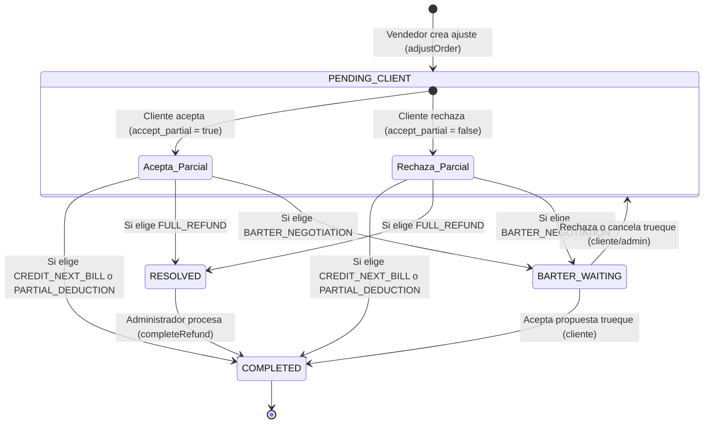

# Ajustes de Pedidos y Reembolsos

El sistema de Pascalle Store cuenta con un ciclo estructurado para manejar diferencias de stock o incidencias en los pedidos a través de **Ajustes y Reembolsos**. Permite a los vendedores reducir las unidades de un pedido y a los clientes elegir cómo ser compensados.

---

## Flujo del Proceso de Ajustes

El flujo de vida de un ajuste de orden consta de tres fases principales: **Creación, Resolución y Cierre**.



### 1. Solicitud de Ajuste (Vendedor)
Cuando un vendedor no puede cumplir con la cantidad total de un pedido, solicita un ajuste desde su panel:
* **Endpoint:** `PUT /api/v1/vendedor/pedidos/{id}/ajustar`
* **Acción:** Se define una cantidad ajustada (`adjusted_quantity`) menor que la original.
* **Cálculo de Reembolsos (Si el pedido ya fue cobrado):**
  * **Inversión (Inversión en CLP):** Se calcula sobre la diferencia de ítems.
    $$\text{Diferencia} = \text{Cant. Original} - \text{Cant. Ajustada}$$
    $$\text{Reembolso Inversión} = \text{Diferencia} \times \text{Precio USD} \times \text{Tasa de Cambio} \times (1 + \text{Impuesto \%})$$
    *(Por defecto el impuesto es 8.25%)*
  * **Comisión de Logística:** Se recalcula la comisión del cliente en la carga. Al cambiar la base del pedido, el porcentaje de la comisión puede variar según los tramos de la tabla `CommissionTier`. La diferencia entre la comisión original y la nueva comisión es el reembolso para el cliente.
* **Estado inicial:** El ajuste queda en estado `PENDING_CLIENT`.

### 2. Resolución del Ajuste (Cliente)
El cliente visualiza sus ajustes pendientes y decide cómo resolverlos:
* **Endpoint:** `POST /api/v1/cliente/ajustes/{id}/resolver`
* **Opciones del Cliente:**
  * **Aceptar Parcial (`accept_partial: true`):** El pedido continúa pero con la cantidad ajustada.
  * **Rechazar Parcial (`accept_partial: false` - Opción B):** 
    > [!IMPORTANT]
    > **Restricción de Cancelación Total:**
    > El cliente **ya no tiene permitido** cancelar la orden por completo (rechazar la recepción parcial) cuando se trate de un ajuste derivado de diferencias físicas tras la revisión en bodega. El backend arrojará una excepción `BadRequestException` indicando: *"No se permite la cancelación total del pedido. Debe aceptar el despacho de las unidades físicas disponibles y procesar la compensación de las diferencias."*
    > 
    > La cancelación total (`accept_partial: false`) queda habilitada cuando se trate de un ajuste derivado de una transición de carga solicitada por el vendedor (`is_transition_request: true`), **o** cuando un administrador la haya habilitado manualmente para ese ajuste puntual (`client_cancel_unlocked: true`) mediante `POST /api/v1/admin/ajustes/{id}/habilitar-cancelacion`.
* **Métodos de Compensación (`compensation_method`):**
  * `CREDIT_NEXT_BILL`: Genera un abono o nota de crédito (`ClientCredit`) aplicable al siguiente cobro del cliente. El ajuste pasa a `COMPLETED`.
  * `PARTIAL_DEDUCTION`: Deduce el dinero directamente de la factura (Cobro) actual si esta se encuentra pendiente (`PENDING`, `OVERDUE`, `RETRY`, `IN_REVIEW`), regenerando su PDF de cobro. El ajuste pasa a `COMPLETED`.
  * `FULL_REFUND`: Solicita una transferencia bancaria de devolución. El ajuste pasa a `RESOLVED` (en espera de pago administrativo).
  * `BARTER_NEGOTIATION`: Solicita un trueque (cambio por producto de igual valor). Genera automáticamente un ticket `BARTER_NEGOTIATION` para el admin, bloqueando el ajuste original hasta que el cliente acepte (completa el ajuste) o rechace/cancele (reconvierte a `PENDING_CLIENT`).

> [!IMPORTANT]
> En todos los casos resueltos, el sistema genera y sube un comprobante en PDF del reembolso a un bucket de S3.

### 3. Cierre de Reembolso (Administrador)
Si el cliente opta por `FULL_REFUND` (transferencia), el administrador debe procesar la devolución manual:
* **Endpoint:** `POST /api/v1/admin/ajustes/{id}/completar-reembolso`
* **Acción:** El administrador realiza la transferencia bancaria y registra el comprobante en el sistema.
* **Estado final:** El ajuste se marca como `COMPLETED` y se notifica al usuario final.

---

## 3. Prorrateo y Distribución de Costos de Flete (Cajas Compartidas)

Anteriormente, las órdenes tenían una relación directa ManyToOne con una caja física. Tras la flexibilización logística, las órdenes ahora pueden estar asociadas a **múltiples cajas** (relación ManyToMany) a través de la tabla pivot `order_cajas`. 

Para evitar cobros dobles e inconsistencias en la facturación semanal, el cálculo de cobro del flete se realiza de forma estrictamente prorrateada bajo las siguientes reglas:

1. **Costo de Flete de Caja Individual:** Se calcula el costo flete total de cada caja según su tamaño parametrizado (`caja_size`).
2. **Costo Proporcional por Pedido:** En una caja compartida por $N$ pedidos, la porción del flete correspondiente a cada pedido se calcula dividiendo el costo total de la caja de forma equitativa:
   $$\text{Costo Proporcional del Pedido } P \text{ en Caja } C = \frac{\text{Costo Flete Total de la Caja } C}{\text{Cantidad de Pedidos Asignados a la Caja } C}$$
3. **Acumulación de Flete Final:** Si un pedido está distribuido físicamente en múltiples cajas, su flete total facturado es la sumatoria de todas las porciones proporcionales calculadas en cada caja donde tenga presencia:
   $$\text{Flete Total Facturado para el Pedido } P = \sum_{C \in \text{Cajas del Pedido } P} \text{Costo Proporcional del Pedido } P \text{ en Caja } C$$

Este motor de prorrateo se ejecuta de forma transaccional al invocarse la generación de cobros del flete logístico semanal.

---

## Solicitudes de Devolución (Return Requests)

El sistema permite a los clientes solicitar la devolución de un producto/pedido después de que haya sido entregado. Estas solicitudes son evaluadas y resueltas por el administrador.

### 1. Creación de Solicitud (Cliente)
El cliente inicia el proceso indicando la entrega, el pedido y la justificación.
* **Endpoint:** `POST /api/v1/cliente/devoluciones`
* **Body:** `CreateReturnRequestDto`
  * `delivery_id` (numérico, requerido): ID de la entrega asociada.
  * `order_id` (numérico, requerido): ID del pedido a devolver.
  * `reason` (string, requerido): Motivo de la solicitud de devolución.

### 2. Resolución de Devolución (Administrador)
El administrador revisa la solicitud de devolución y la aprueba o la rechaza.
* **Endpoint:** `POST /api/v1/admin/devoluciones/{id}/resolver`
* **Body:** `ResolveReturnRequestDto`
  * `status` (string, requerido): `APPROVED` o `REJECTED`.
  * **Si es `APPROVED` (Aprobado):**
    * Debe especificarse obligatoriamente la opción de compensación mediante el campo `option`.
    * `option` (string, requerido):
      * `CREDIT_NEXT_BILL`: Genera un abono/nota de crédito (`ClientCredit`) para el siguiente cobro. La devolución pasa a `COMPLETED`.
      * `FULL_REFUND`: Solicita transferencia manual. La devolución pasa a `RESOLVED`.
  * **Si es `REJECTED` (Rechazado):**
    * Requiere obligatoriamente un motivo y una URL de prueba de la evidencia del rechazo.
    * `reject_reason` (string, requerido): Motivo del rechazo.
    * `reject_proof_url` (string, requerido): Enlace a la imagen o documento de evidencia del rechazo.

---

## Referencia de Endpoints Relacionados

### Vendedor
* **Solicitar Ajuste:** `PUT /api/v1/vendedor/pedidos/{id}/ajustar`
  * Body: `AdjustOrderDto` (`adjusted_quantity`, `reason`)

### Cliente
* **Listar Ajustes Pendientes:** `GET /api/v1/cliente/ajustes/pendientes`
* **Resolver Ajuste:** `POST /api/v1/cliente/ajustes/{id}/resolver`
  * Body: `ResolveAdjustmentDto` (`accept_partial`, `compensation_method`)
* **Listar Notas de Crédito:** `GET /api/v1/cliente/creditos`
* **Crear Solicitud de Devolución:** `POST /api/v1/cliente/devoluciones`
  * Body: `CreateReturnRequestDto` (`delivery_id`, `order_id`, `reason`)
* **Listar Devoluciones Propias:** `GET /api/v1/cliente/devoluciones` (Soporta paginación con `page` y `limit`)

### Administrador
* **Listar Reembolsos Pendientes:** `GET /api/v1/admin/reembolsos/pendientes`
* **Completar Reembolso Manual:** `POST /api/v1/admin/ajustes/{id}/completar-reembolso`
  * Body: `CompleteRefundDto` (`comment`, `payment_proof_url`)
* **Listar Ajustes de Bodega Pendientes:** `GET /api/v1/admin/ajustes/pendientes` (Soporta paginación con `page` y `limit`)
  * Devuelve los ajustes `PENDING_CLIENT` derivados de diferencias físicas en bodega (`is_transition_request: false`), incluyendo su estado actual de `client_cancel_unlocked`.
* **Habilitar Cancelación Total de un Ajuste:** `POST /api/v1/admin/ajustes/{id}/habilitar-cancelacion`
  * Body: `UnlockAdjustmentCancellationDto` (`admin_comment`, opcional)
  * Habilita, para ese ajuste puntual, que el cliente pueda resolver con `accept_partial: false`. Solo aplica a ajustes `PENDING_CLIENT` que no sean de transición de carga y que no estén ya habilitados. Notifica al cliente al ejecutarse.
* **Listar Solicitudes de Devolución:** `GET /api/v1/admin/devoluciones` (Soporta paginación con `page` y `limit`)
* **Resolver Solicitud de Devolución:** `POST /api/v1/admin/devoluciones/{id}/resolver`
  * Body: `ResolveReturnRequestDto` (`status`, `option`, `reject_reason`, `reject_proof_url`)

---

## 4. Cobros y Billing (Rutas Completas)

### 4.1 Gestión de Cobros (Admin)

| Método | Ruta | Roles | Descripción |
| :--- | :--- | :--- | :--- |
| `GET` | `/api/v1/admin/cobros` | `ADMIN`, `ROOT` | Listado paginado de cobros con filtros. |
| `GET` | `/api/v1/admin/cobros/pendientes-validacion` | `ADMIN`, `ROOT` | Cobros con comprobante subido pendientes de revisión. |
| `GET` | `/api/v1/admin/cobros/:id` | `ADMIN`, `ROOT` | Detalle de un cobro específico. |
| `POST` | `/api/v1/admin/cobros/:id/confirmar` | `ADMIN`, `ROOT` | Confirmar, rechazar o reintentar un cobro. |
| `POST` | `/api/v1/admin/cobros/trigger` | `ADMIN`, `ROOT` | Disparar manualmente el proceso de billing. |

#### Listar Cobros Admin

- **Método:** `GET`
- **Ruta:** `/api/v1/admin/cobros`
- **Query Parameters:**
  - `filter` (opcional, string): `pendientes` | `listos_para_revisar` | `pagados` (sin filtro = todos).
  - `page` (opcional, default `1`): Página.
  - `limit` (opcional, default `20`): Registros por página.

#### Disparar Billing Manual (Trigger)

- **Método:** `POST`
- **Ruta:** `/api/v1/admin/cobros/trigger`
- **Query Parameters:**
  - `forceDay` (opcional, enum): `tuesday` | `friday` — Forzar ejecución como si fuera el día especificado.
- **Respuesta (200 OK):**
  ```json
  {
    "ok": true,
    "message": "Procesamiento de facturación y moras completado.",
    "billResult": { ... }
  }
  ```

> [!CAUTION]
> Este endpoint ejecuta la generación de cobros y el procesamiento de moras de forma inmediata. Úsalo con precaución en entornos productivos para evitar duplicar cobros.

### 4.2 Cobros del Cliente

| Método | Ruta | Roles | Descripción |
| :--- | :--- | :--- | :--- |
| `GET` | `/api/v1/cliente/cobros` | `CLIENT` | Listar cobros del cliente (`carga_id?`, `page`, `limit`). |
| `GET` | `/api/v1/cliente/cobros/:id` | `CLIENT` | Detalle de un cobro propio. Cada ítem (`items[]`) incluye `photo_urls` (fotos del producto de la orden, firmadas), `cantidad` (`order.total_items`) y `talla` (`order.talla`). Incluye `events` (`CobroEventDto[]`) con la Tabla de Novedades, Cancelaciones y Ajustes. |
| `GET` | `/api/v1/cliente/cobros/:id/pdf` | `CLIENT`, `ADMIN`, `ROOT` | Descargar PDF del cobro. Renderiza la Tabla de Novedades y muestra la etiqueta **'Crédito Aplicado'** en el resumen financiero si aplica descuento/saldo a favor. |
| `GET` | `/api/v1/cliente/cobros/:id/ordenes` | `CLIENT` | Órdenes asociadas al cobro. |
| `GET` | `/api/v1/cliente/cobros/pagados` | `CLIENT` | Listado de cobros ya confirmados/pagados. |
| `GET` | `/api/v1/cliente/estado-mora` | `CLIENT` | Estado de mora actual del cliente. |
| `POST` | `/api/v1/cliente/cobros/:id/pagar` | `CLIENT` | Subir comprobante(s) de pago (max 4 archivos). |
| `DELETE` | `/api/v1/cliente/cobros/:id/comprobante` | `CLIENT` | Eliminar un comprobante de pago subido. |

#### Tabla de Novedades, Cancelaciones y Ajustes (`events`)

Tanto `GET /api/v1/cliente/cobros/:id` como `GET /api/v1/admin/cobros/:id` retornan la propiedad `events` conteniendo un arreglo de objetos `CobroEventDto`:
- `order_id` (number): ID del pedido.
- `product_name` (string): Nombre o marca del producto.
- `photo_url` (string | null): URL firmada de la imagen del producto.
- `event_type` (enum): `CANCELLED` | `DELAYED` | `ADJUSTED`.
- `event_type_label` (string): Descripción en texto del evento (ej. *"Pedido Cancelado"*, *"Traspaso a otra carga"*, *"Devolución de producto"*).
- `reason` (string | null): Motivo del evento o ajuste.
- `refund_clp` (number, opcional): Monto de reembolso asociado en CLP.
- `financial_impact_label` (string): Etiqueta legible del impacto financiero.
- `created_at` (string/Date): Fecha de registro del evento.

#### Descargar PDF del Cobro

- **Método:** `GET`
- **Ruta:** `/api/v1/cliente/cobros/:id/pdf`
- **Roles Permitidos:** `CLIENT`, `ADMIN`, `ROOT`
- **Respuesta:** Archivo PDF con `Content-Type: application/pdf` y `Content-Disposition: inline`.
- **Estructura del PDF:** Incluye la **Tabla de Novedades, Cancelaciones y Ajustes** antes del resumen financiero, y despliega la etiqueta **'Crédito Aplicado'** cuando el cobro incluye descuento/saldo abonado (`discount_clp > 0`).

#### Subir Comprobante de Pago

- **Método:** `POST`
- **Ruta:** `/api/v1/cliente/cobros/:id/pagar`
- **Roles Permitidos:** `CLIENT`
- **Content-Type:** `multipart/form-data`
- **Campos:** `files` (campo de archivos múltiples, máximo 4 acumulados).

#### Eliminar Comprobante

- **Método:** `DELETE`
- **Ruta:** `/api/v1/cliente/cobros/:id/comprobante`
- **Roles Permitidos:** `CLIENT`
- **Cuerpo (JSON):** `{ "url": "https://s3.amazonaws.com/..." }` — URL del comprobante a eliminar.

### 4.3 Pagos del Vendedor

| Método | Ruta | Roles | Descripción |
| :--- | :--- | :--- | :--- |
| `POST` | `/api/v1/vendedor/pagos/solicitar` | `VENDOR` | Solicitar retiro/cobro de ventas. |
| `GET` | `/api/v1/vendedor/pagos` | `VENDOR` | Listar solicitudes de pago del vendedor (paginado). |
| `GET` | `/api/v1/vendedor/pagos/:id` | `VENDOR` | Detalle de una solicitud de pago propia. |
| `GET` | `/api/v1/vendedor/ordenes/pendientes-cobro` | `VENDOR` | Órdenes pendientes de liquidación. |

#### Solicitar Pago (Vendedor)

- **Método:** `POST`
- **Ruta:** `/api/v1/vendedor/pagos/solicitar`
- **Content-Type:** `multipart/form-data`
- **Campos:**
  - `files` (archivo, hasta 4): Comprobantes de soporte.
  - `note` (string, opcional): Nota o comentario adicional.
  - `amount` (número, opcional): Monto solicitado en CLP.
  - `order_ids` (array, opcional): IDs de órdenes específicas a liquidar.
- **Respuesta:** `201 Created` con la solicitud de pago creada.

#### Listar Mis Solicitudes de Pago (Vendedor)

Devuelve únicamente las solicitudes del vendedor autenticado, ordenadas por `created_at` descendente.

- **Método:** `GET`
- **Ruta:** `/api/v1/vendedor/pagos`
- **Roles Permitidos:** `VENDOR`
- **Query Parameters:**
  - `status` (opcional, string): Filtrar por estado (`PENDING`, `APPROVED`, `REJECTED`).
  - `page` (opcional, default `1`): Número de página.
  - `limit` (opcional, default `20`, máximo `50`): Cantidad de elementos por página.
- **Respuesta Exitosa (200 OK):**
  ```json
  {
    "data": [
      {
        "id": 10,
        "vendor_id": 7,
        "amount": "350000.00",
        "status": "PENDING",
        "note": "Solicitud de retiro semanal",
        "evidence_urls": [
          "https://bucket.s3.amazonaws.com/comprobante1.jpg?X-Amz-Signature=..."
        ],
        "created_at": "2026-07-28T10:00:00.000Z",
        "updated_at": "2026-07-28T10:00:00.000Z",
        "vendor": {
          "id": 7,
          "name": "Vendedor Demo"
        }
      }
    ],
    "meta": {
      "total": 1,
      "page": 1,
      "limit": 20,
      "last_page": 1
    }
  }
  ```
  - `amount` (string): Monto decimal serializado como string.
  - `evidence_urls` (array): Comprobantes resueltos a URLs firmadas de S3.

> [!NOTE]
> Los administradores no consultan estas rutas: disponen de `GET /api/v1/admin/vendedor/pagos` y `GET /api/v1/admin/vendedor/pagos/:id` para revisar las solicitudes de todos los vendedores.

#### Obtener Detalle de Solicitud de Pago

- **Método:** `GET`
- **Ruta:** `/api/v1/vendedor/pagos/:id`
- **Roles Permitidos:** `VENDOR`
- **Path Parameters:**
  - `id` (número, requerido): ID de la solicitud de pago.
- **Respuesta Exitosa (200 OK):** Incluye además las órdenes liquidadas (`orders`) con su producto y fotos resueltas a URLs firmadas.
  ```json
  {
    "id": 10,
    "vendor_id": 7,
    "amount": "350000.00",
    "status": "PENDING",
    "note": "Solicitud de retiro semanal",
    "evidence_urls": [
      "https://bucket.s3.amazonaws.com/comprobante1.jpg?X-Amz-Signature=..."
    ],
    "created_at": "2026-07-28T10:00:00.000Z",
    "updated_at": "2026-07-28T10:00:00.000Z",
    "vendor": { "id": 7, "name": "Vendedor Demo" },
    "orders": [
      {
        "id": 45,
        "product": {
          "id": 88,
          "photo_urls": ["https://bucket.s3.amazonaws.com/prod.jpg?X-Amz-Signature=..."]
        }
      }
    ]
  }
  ```
- **Error (404 Not Found):** `Solicitud de pago #{id} no encontrada` si el ID no existe o no pertenece al vendedor autenticado.

---

## 5. Tipo de Cambio (Dólar)

### 5.1 Tipo de Cambio Actual (Público)

Devuelve el tipo de cambio USD → CLP oficial vigente.

- **Método:** `GET`
- **Ruta:** `/api/v1/billing/exchange-rate`
- **Roles Permitidos:** Sin autenticación requerida (público).
- **Respuesta (200 OK):**
  ```json
  {
    "rate": 950.50,
    "created_at": "2026-07-20T08:00:00.000Z"
  }
  ```

### 5.2 Actualizar Tipo de Cambio (Admin)

- **Método:** `POST`
- **Ruta:** `/api/v1/admin/exchange-rate`
- **Roles Permitidos:** `ADMIN`, `ROOT`
- **Cuerpo (JSON):**
  ```json
  {
    "rate": 955.00
  }
  ```
- **Respuesta Exitosa (200 OK):** Retorna la entidad `ExchangeRate` recién creada y persistida.
  ```json
  {
    "id": 1,
    "rate": 955,
    "changed_by_id": 2,
    "created_at": "2026-08-07T12:00:00.000Z"
  }
  ```

> [!NOTE]
> **Emisión WebSockets en Tiempo Real (`AppGateway.broadcastExchangeRateUpdate`):**
> Al actualizar con éxito el tipo de cambio, el servidor transmite inmediatamente dos eventos por WebSocket a todos los clientes conectados:
> 1. `exchange_rate_updated`: Payload con el objeto entidad `ExchangeRate` (`{ id, rate, changed_by_id, created_at }`).
> 2. `product_updated`: Payload `{ action: "update", product: null }` para notificar a las aplicaciones clientes que deben refrescar/recalcular los precios convertidos a CLP (`price_usd * rate`).

### 5.3 Historial de Tipo de Cambio

- **Método:** `GET`
- **Ruta:** `/api/v1/admin/exchange-rate/history`
- **Roles Permitidos:** `ADMIN`, `ROOT`
- **Query Parameters:** `page`, `limit`

---

## 6. Tarifas de Comisiones y Logística

### 6.1 Tabla de Comisiones

| Método | Ruta | Roles | Descripción |
| :--- | :--- | :--- | :--- |
| `GET` | `/api/v1/tarifas/comisiones` | Todos | Consultar tabla de comisiones por tramos. |
| `PUT` | `/api/v1/admin/tarifas/comisiones` | `ADMIN`, `ROOT` | Actualizar comisiones. |

- **GET** — Devuelve los tramos de comisión (`CommissionTier`) aplicables según el volumen de inversión.
- **PUT** — Cuerpo: `UpdateCommissionTierDto` con los nuevos tramos y porcentajes.

### 6.2 Tarifas Logísticas

| Método | Ruta | Roles | Descripción |
| :--- | :--- | :--- | :--- |
| `GET` | `/api/v1/tarifas/logisticas` | Todos | Consultar tarifas de flete y logística. |
| `POST` | `/api/v1/admin/tarifas/logisticas` | `ADMIN`, `ROOT` | Crear nueva tarifa logística. |
| `PUT` | `/api/v1/admin/tarifas/logisticas` | `ADMIN`, `ROOT` | Actualizar tarifa logística existente. |

- **GET** — Devuelve el listado de tarifas por tipo de transporte (`AEREA`, `MARITIMA`) y tamaño de caja.
  - `concept` (opcional, string): Filtrar por concepto de tarifa. Búsqueda parcial e insensible a mayúsculas/minúsculas (ILIKE `%concept%`). Ejemplo: `?concept=flete` retorna todas las tarifas cuyo campo `concept` contenga la palabra "flete".
- **POST** — Cuerpo: `CreateLogisticsRateDto`.
- **PUT** — Cuerpo: `UpdateLogisticsRateDto`.

