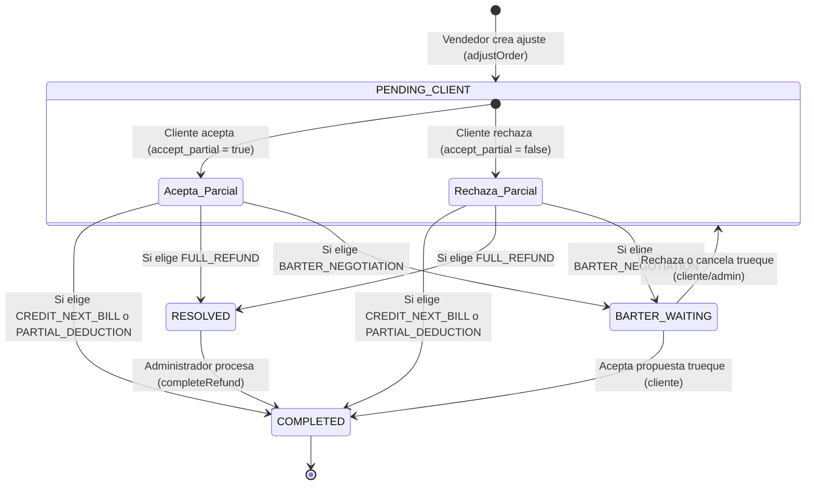

# Ajustes de Pedidos y Reembolsos

El sistema de Pascalle Store cuenta con un ciclo estructurado para manejar diferencias de stock o incidencias en los pedidos a través de **Ajustes y Reembolsos**. Permite a los vendedores reducir las unidades de un pedido y a los clientes elegir cómo ser compensados.

---

## Flujo del Proceso de Ajustes

El flujo de vida de un ajuste de orden consta de tres fases principales: **Creación, Resolución y Cierre**.

### 1. Solicitud de Ajuste (Vendedor)
Cuando un vendedor no puede cumplir con la cantidad total de un pedido, solicita un ajuste desde su panel:
* **Endpoint:** `PUT /api/v1/vendedor/pedidos/{id}/ajustar`
* **Acción:** Se define una cantidad ajustada (`adjusted_quantity`) menor que la original.
* **Cálculo de Reembolsos (Si el pedido ya fue cobrado):**
  * **Inversión (Inversión en CLP):** Se calcula sobre la diferencia de ítems.
    $$\text{Diferencia} = \text{Cant. Original} - \text{Cant. Ajustada}$$
    $$\text{Reembolso Inversión} = \text{Diferencia} \times \text{Precio USD} \times \text{Tasa de Cambio} \times (1 + \text{Impuesto \%})$$
    *(Por defecto el impuesto es 8.25%)*
  * **Comisión de Logística:** Se recalcula la comisión del cliente en la carga. Al cambiar la base del pedido, el porcentaje de la comisión puede variar según los tramos de la tabla `CommissionTier`. La diferencia entre la comisión original y la nueva comisión es el reembolso para el cliente.
* **Estado inicial:** El ajuste queda en estado `PENDING_CLIENT`.

### 2. Resolución del Ajuste (Cliente)
El cliente visualiza sus ajustes pendientes y decide cómo resolverlos:
* **Endpoint:** `POST /api/v1/cliente/ajustes/{id}/resolver`
* **Opciones del Cliente:**
  * **Aceptar Parcial (`accept_partial: true`):** El pedido continúa pero con la cantidad ajustada.
  * **Rechazar Parcial (`accept_partial: false` - Opción B):** 
    > [!IMPORTANT]
    > **Restricción de Cancelación Total:**
    > El cliente **ya no tiene permitido** cancelar la orden por completo (rechazar la recepción parcial) cuando se trate de un ajuste derivado de diferencias físicas tras la revisión en bodega. El backend arrojará una excepción `BadRequestException` indicando: *"No se permite la cancelación total del pedido. Debe aceptar el despacho de las unidades físicas disponibles y procesar la compensación de las diferencias."*
    > 
    > La cancelación total (`accept_partial: false`) **únicamente** queda habilitada cuando se trate de un ajuste derivado de una transición de carga solicitada por el vendedor (`is_transition_request: true`).
* **Métodos de Compensación (`compensation_method`):**
  * `CREDIT_NEXT_BILL`: Genera un abono o nota de crédito (`ClientCredit`) aplicable al siguiente cobro del cliente. El ajuste pasa a `COMPLETED`.
  * `PARTIAL_DEDUCTION`: Deduce el dinero directamente de la factura (Cobro) actual si esta se encuentra pendiente (`PENDING`, `OVERDUE`, `RETRY`, `IN_REVIEW`), regenerando su PDF de cobro. El ajuste pasa a `COMPLETED`.
  * `FULL_REFUND`: Solicita una transferencia bancaria de devolución. El ajuste pasa a `RESOLVED` (en espera de pago administrativo).
  * `BARTER_NEGOTIATION`: Solicita un trueque (cambio por producto de igual valor). Genera automáticamente un ticket `BARTER_NEGOTIATION` para el admin, bloqueando el ajuste original hasta que el cliente acepte (completa el ajuste) o rechace/cancele (reconvierte a `PENDING_CLIENT`).

> [!IMPORTANT]
> En todos los casos resueltos, el sistema genera y sube un comprobante en PDF del reembolso a un bucket de S3.

### 3. Cierre de Reembolso (Administrador)
Si el cliente opta por `FULL_REFUND` (transferencia), el administrador debe procesar la devolución manual:
* **Endpoint:** `POST /api/v1/admin/ajustes/{id}/completar-reembolso`
* **Acción:** El administrador realiza la transferencia bancaria y registra el comprobante en el sistema.
* **Estado final:** El ajuste se marca como `COMPLETED` y se notifica al usuario final.

---

## 3. Prorrateo y Distribución de Costos de Flete (Cajas Compartidas)

Anteriormente, las órdenes tenían una relación directa ManyToOne con una caja física. Tras la flexibilización logística, las órdenes ahora pueden estar asociadas a **múltiples cajas** (relación ManyToMany) a través de la tabla pivot `order_cajas`. 

Para evitar cobros dobles e inconsistencias en la facturación semanal, el cálculo de cobro del flete se realiza de forma estrictamente prorrateada bajo las siguientes reglas:

1. **Costo de Flete de Caja Individual:** Se calcula el costo flete total de cada caja según su tamaño parametrizado (`caja_size`).
2. **Costo Proporcional por Pedido:** En una caja compartida por $N$ pedidos, la porción del flete correspondiente a cada pedido se calcula dividiendo el costo total de la caja de forma equitativa:
   $$\text{Costo Proporcional del Pedido } P \text{ en Caja } C = \frac{\text{Costo Flete Total de la Caja } C}{\text{Cantidad de Pedidos Asignados a la Caja } C}$$
3. **Acumulación de Flete Final:** Si un pedido está distribuido físicamente en múltiples cajas, su flete total facturado es la sumatoria de todas las porciones proporcionales calculadas en cada caja donde tenga presencia:
   $$\text{Flete Total Facturado para el Pedido } P = \sum_{C \in \text{Cajas del Pedido } P} \text{Costo Proporcional del Pedido } P \text{ en Caja } C$$

Este motor de prorrateo se ejecuta de forma transaccional al invocarse la generación de cobros del flete logístico semanal.

---

## Solicitudes de Devolución (Return Requests)

El sistema permite a los clientes solicitar la devolución de un producto/pedido después de que haya sido entregado. Estas solicitudes son evaluadas y resueltas por el administrador.

### 1. Creación de Solicitud (Cliente)
El cliente inicia el proceso indicando la entrega, el pedido y la justificación.
* **Endpoint:** `POST /api/v1/cliente/devoluciones`
* **Body:** `CreateReturnRequestDto`
  * `delivery_id` (numérico, requerido): ID de la entrega asociada.
  * `order_id` (numérico, requerido): ID del pedido a devolver.
  * `reason` (string, requerido): Motivo de la solicitud de devolución.

### 2. Resolución de Devolución (Administrador)
El administrador revisa la solicitud de devolución y la aprueba o la rechaza.
* **Endpoint:** `POST /api/v1/admin/devoluciones/{id}/resolver`
* **Body:** `ResolveReturnRequestDto`
  * `status` (string, requerido): `APPROVED` o `REJECTED`.
  * **Si es `APPROVED` (Aprobado):**
    * Debe especificarse obligatoriamente la opción de compensación mediante el campo `option`.
    * `option` (string, requerido):
      * `CREDIT_NEXT_BILL`: Genera un abono/nota de crédito (`ClientCredit`) para el siguiente cobro. La devolución pasa a `COMPLETED`.
      * `FULL_REFUND`: Solicita transferencia manual. La devolución pasa a `RESOLVED`.
  * **Si es `REJECTED` (Rechazado):**
    * Requiere obligatoriamente un motivo y una URL de prueba de la evidencia del rechazo.
    * `reject_reason` (string, requerido): Motivo del rechazo.
    * `reject_proof_url` (string, requerido): Enlace a la imagen o documento de evidencia del rechazo.

---

## Referencia de Endpoints Relacionados

### Vendedor
* **Solicitar Ajuste:** `PUT /api/v1/vendedor/pedidos/{id}/ajustar`
  * Body: `AdjustOrderDto` (`adjusted_quantity`, `reason`)

### Cliente
* **Listar Ajustes Pendientes:** `GET /api/v1/cliente/ajustes/pendientes`
* **Resolver Ajuste:** `POST /api/v1/cliente/ajustes/{id}/resolver`
  * Body: `ResolveAdjustmentDto` (`accept_partial`, `compensation_method`)
* **Listar Notas de Crédito:** `GET /api/v1/cliente/creditos`
* **Crear Solicitud de Devolución:** `POST /api/v1/cliente/devoluciones`
  * Body: `CreateReturnRequestDto` (`delivery_id`, `order_id`, `reason`)
* **Listar Devoluciones Propias:** `GET /api/v1/cliente/devoluciones` (Soporta paginación con `page` y `limit`)

### Administrador
* **Listar Reembolsos Pendientes:** `GET /api/v1/admin/reembolsos/pendientes`
* **Completar Reembolso Manual:** `POST /api/v1/admin/ajustes/{id}/completar-reembolso`
  * Body: `CompleteRefundDto` (`comment`, `payment_proof_url`)
* **Listar Solicitudes de Devolución:** `GET /api/v1/admin/devoluciones` (Soporta paginación con `page` y `limit`)
* **Resolver Solicitud de Devolución:** `POST /api/v1/admin/devoluciones/{id}/resolver`
  * Body: `ResolveReturnRequestDto` (`status`, `option`, `reject_reason`, `reject_proof_url`)
