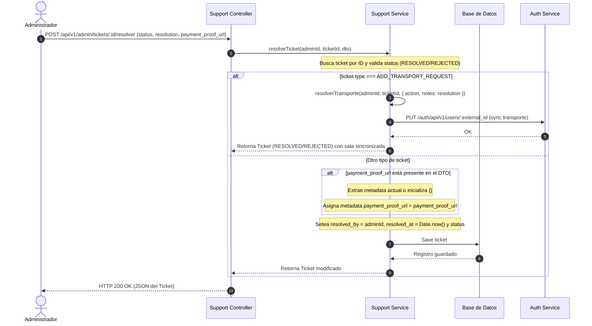

# Guía de Referencia de la API del Administrador (Admin API)

Esta guía documenta los endpoints administrativos, de monitoreo y del sistema expuestos en el backend de **Pascalle Store** bajo el prefijo `/api/v1/`.

---

## Resumen de Endpoints Administrados

Esta tabla consolida los endpoints disponibles para roles de administración y gestión del sistema. Todos los endpoints requieren autenticación mediante token de portador (`Bearer`).

| Módulo | Método | Ruta | Roles Permitidos | Descripción |
| :--- | :--- | :--- | :--- | :--- |
| **Soporte** | `GET` | `/api/v1/admin/tickets`<br> `/api/v1/admin/soporte/tickets` | `ADMIN`, `ROOT` | Listado y bandeja de entrada unificada de tickets de soporte. |
| **Soporte** | `POST`<br>`PUT` | `/api/v1/admin/tickets/:id/resolver`<br> `/api/v1/admin/soporte/tickets/:id/resolucion` | `ADMIN`, `ROOT` | Resuelve un ticket asignándole un estado, resolución y comprobante opcional (delega a la resolución de transporte si el ticket es `ADD_TRANSPORT_REQUEST`). |
| **Soporte** | `POST` | `/api/v1/admin/tickets/:id/proponer-trueque` | `ADMIN`, `ROOT` | Envía una propuesta de trueque para tickets de negociación. |
| **Soporte** | `POST` | `/api/v1/admin/tickets/:id/resolver-transporte` | `ADMIN`, `ROOT` | Aprueba o rechaza una solicitud de acceso a sala de transporte (`ADD_TRANSPORT_REQUEST`); también alcanzable vía los endpoints genéricos de resolución. |
| **Usuarios** | `GET` | `/api/v1/admin/users` | `ADMIN`, `ROOT` | Listado avanzado de usuarios con filtros de mora, deuda, salas y búsqueda. |
| **Usuarios** | `GET` | `/api/v1/users` | `ADMIN`, `ROOT` | Obtención básica de usuarios con paginación general. |
| **Usuarios** | `GET` | `/api/v1/users/:id` | `ADMIN`, `ROOT` | Resumen detallado del perfil y transacciones de un usuario. |
| **Usuarios** | `GET` | `/api/v1/users/:id/orders` | `ADMIN`, `ROOT` | Consulta las órdenes de un usuario. |
| **Usuarios** | `GET` | `/api/v1/users/:id/pedidos` | `ADMIN`, `ROOT` | Alias para la consulta de órdenes de un usuario. |
| **Usuarios** | `GET` | `/api/v1/users/:id/cobros` | `ADMIN`, `ROOT` | Consulta el historial de cobros de un usuario. |
| **Usuarios** | `DELETE`| `/api/v1/users/:id` | `ROOT` | Eliminación de un usuario del sistema. |
| **Usuarios** | `POST` | `/api/v1/admin/users/:id/bloquear` | `ADMIN`, `ROOT` | Bloquea manualmente a un usuario `CLIENT`, `VENDOR` o `BODEGUERO` (impide login y revoca sesión). |
| **Usuarios** | `POST` | `/api/v1/admin/users/:id/desbloquear` | `ADMIN`, `ROOT` | Desbloquea manualmente a un usuario `CLIENT`, `VENDOR` o `BODEGUERO`. |
| **Usuarios** | `POST` | `/api/v1/admin/admins/:id/bloquear` | `ROOT` | Bloquea manualmente a un usuario `ADMIN` (exclusivo de Root). |
| **Usuarios** | `POST` | `/api/v1/admin/admins/:id/desbloquear` | `ROOT` | Desbloquea manualmente a un usuario `ADMIN` (exclusivo de Root). |
| **Usuarios** | `POST` | `/api/v1/users/change-contact/request` | `ROOT`, `ADMIN`, `CLIENT`, `VENDOR`, `BODEGUERO` | Solicita código/token para cambio de teléfono o correo de contacto. |
| **Usuarios** | `POST` | `/api/v1/users/change-contact/verify` | `ROOT`, `ADMIN`, `CLIENT`, `VENDOR`, `BODEGUERO` | Verifica el token enviado y confirma la actualización del contacto. |
| **Usuarios** | `GET` | `/api/v1/registration-requests` | `ADMIN`, `ROOT` | Obtiene el listado de solicitudes de registro pendientes con paginación offset. |
| **Usuarios** | `POST` | `/api/v1/registration-requests/:email/approve` | `ADMIN`, `ROOT` | Aprueba la solicitud de onboarding de un cliente e inyecta reviewedBy. |
| **Usuarios** | `POST` | `/api/v1/registration-requests/:email/reject` | `ADMIN`, `ROOT` | Rechaza la solicitud de onboarding de un cliente e inyecta reviewedBy. |
| **Usuarios** | `POST` | `/api/v1/registration-requests/notify-admin` | Sin autenticación (uso interno) | Notifica a los administradores (persistido + WebSocket) de una nueva solicitud de registro creada en `Importal-registration-lambda` (DynamoDB). |
| **Cobros** | `GET` | `/api/v1/admin/cobros/pendientes-validacion` | `ADMIN`, `ROOT` | Obtiene cobros pendientes con soporte para paginación (`page`, `limit`). |
| **Cobros** | `POST` | `/api/v1/admin/cobros/:id/confirmar` | `ADMIN`, `ROOT` | Confirma, rechaza o reintenta el pago de un cobro con parámetro `action`. |
| **Cobros** | `GET` | `/api/v1/admin/vendedor/pagos` | `ADMIN`, `ROOT` | Listar solicitudes de pago de los vendedores con filtros de estado. |
| **Cobros** | `GET` | `/api/v1/admin/vendedor/pagos/:id` | `ADMIN`, `ROOT` | Obtener el detalle de una solicitud de cobro del vendedor y órdenes. |
| **Cobros** | `POST` | `/api/v1/admin/vendedor/pagos/:id/procesar` | `ADMIN`, `ROOT` | Aprobar o rechazar la solicitud de cobro de un vendedor. |
| **Métricas** | `GET` | `/api/v1/admin/metrics/carga/:id` | `ADMIN`, `ROOT` | Obtener métricas consolidadas de una carga de importación. |
| **Métricas** | `GET` | `/api/v1/vendedor/metrics/carga/:id` | `VENDOR` | Obtener métricas de la carga correspondientes al vendedor. |
| **Reembolsos** | `POST` | `/api/v1/admin/orders/adjustments/:id/authorize-full-refund` | `ADMIN`, `ROOT` | Forzar y autorizar de forma excepcional un reembolso del 100% de la orden. |
| **Exchange Rates**| `GET`| `/api/v1/admin/exchange-rate/history` | `ADMIN`, `ROOT` | Historial de tipo de cambio oficial con soporte para paginación (`page`, `limit`). |
| **Entregas** | `GET` | `/api/v1/admin/deliveries` | `ADMIN`, `ROOT` | Listado y filtros de entregas asociadas a clientes con paginación (`page`, `limit`). |
| **Devoluciones**| `GET`| `/api/v1/admin/devoluciones` | `ADMIN`, `ROOT` | Listado de solicitudes de devolución con paginación (`page`, `limit`). |
| **Devoluciones**| `POST`| `/api/v1/admin/devoluciones/:id/resolver` | `ADMIN`, `ROOT` | Resuelve una solicitud de devolución (`APPROVED`, `REJECTED`) con opciones y justificación. |
| **Auditoría**| `GET` | `/api/v1/admin/logs` | `ADMIN`, `ROOT` | Consulta y filtra los logs del servidor (según nivel o servicio). |
| **Auditoría**| `GET` | `/api/v1/admin/logs/search` | `ADMIN`, `ROOT` | Realiza búsquedas de texto plano dentro del historial de logs. |
| **Auditoría**| `GET` | `/api/v1/admin/audit/trail` | `ADMIN`, `ROOT` | Consulta la pista de auditoría del sistema (acciones sobre recursos). |
| **Auditoría**| `GET` | `/api/v1/admin/audit/trail/:id` | `ADMIN`, `ROOT` | Detalle específico y payload original de un registro de auditoría. |
| **Auditoría**| `GET` | `/api/v1/admin/users/activity` | `ADMIN`, `ROOT` | Métricas y estadísticas consolidadas de actividad de usuarios. |
| **Auditoría**| `GET` | `/api/v1/admin/users/:userId/session-log` | `ADMIN`, `ROOT` | Historial de inicios y cierres de sesión de un usuario. |
| **Auditoría**| `GET` | `/api/v1/admin/users/:userId/actions-log` | `ADMIN`, `ROOT` | Historial de acciones operativas realizadas por un usuario. |
| **Auditoría**| `GET` | `/api/v1/admin/users/login-attempts` | `ADMIN`, `ROOT` | Registros de intentos fallidos o sospechosos de login. |
| **Auditoría**| `GET` | `/api/v1/admin/users/suspicious-activity` | `ADMIN`, `ROOT` | Alertas automáticas de seguridad por actividad inusual. |
| **Auditoría**| `GET` | `/api/v1/admin/exceptions` | `ADMIN`, `ROOT` | Historial de excepciones no controladas capturadas por el backend. |
| **Auditoría**| `GET` | `/api/v1/admin/exceptions/:id` | `ADMIN`, `ROOT` | Detalle técnico y stack trace de un error capturado. |
| **Auditoría**| `GET` | `/api/v1/admin/exceptions/statistics` | `ADMIN`, `ROOT` | Estadísticas agregadas de tipos y frecuencias de errores. |
| **Auditoría**| `GET` | `/api/v1/admin/traces` | `ADMIN`, `ROOT` | Registros de trazas de llamadas HTTP procesadas por el gateway. |
| **Auditoría**| `GET` | `/api/v1/admin/traces/:traceId` | `ADMIN`, `ROOT` | Inspecciona el ciclo de vida de una petición HTTP específica por su Trace ID. |
| **Auditoría**| `GET` | `/api/v1/admin/traces/slow-queries` | `ADMIN`, `ROOT` | Listado de consultas SQL a base de datos que superaron el umbral de alerta. |
| **Monitoreo**| `GET` | `/api/v1/admin/system/health` | `ADMIN`, `ROOT` | Diagnóstico general de salud del servicio (Liveness/Readiness). |
| **Monitoreo**| `GET` | `/api/v1/admin/system/status/database` | `ADMIN`, `ROOT` | Estado, latencia y conexiones activas de la base de datos relacional. |
| **Monitoreo**| `GET` | `/api/v1/admin/system/status/cache` | `ADMIN`, `ROOT` | Uso de memoria, conexiones y hits de la caché Redis. |
| **Monitoreo**| `GET` | `/api/v1/admin/system/status/queue` | `ADMIN`, `ROOT` | Estado y métricas de procesamiento de colas BullMQ. |
| **Tiendas** | `GET` | `/api/v1/tiendas` | `VENDOR`, `ADMIN`, `ROOT` | Obtiene el listado completo de tiendas registradas. |
| **Tiendas** | `POST` | `/api/v1/tiendas` | `VENDOR`, `ADMIN`, `ROOT` | Registra una nueva tienda con nombre único. |
| **Tiendas** | `PUT` | `/api/v1/admin/tiendas/:id` | `ADMIN`, `ROOT` | Actualiza la información de una tienda por su ID. |
| **Tiendas** | `DELETE` | `/api/v1/admin/tiendas/:id` | `ADMIN`, `ROOT` | Elimina una tienda existente del sistema. |

---


## 1. Módulo de Soporte y Tickets (`support`)

Este módulo se encarga del procesamiento de reportes y tickets generados por los usuarios. Las rutas se unificaron para admitir filtros flexibles que permiten construir una bandeja de entrada integradora.

### 1.1 Obtener Tickets (Bandeja de Entrada Unificada)
* **Método:** `GET`
* **Ruta:** `/api/v1/admin/tickets` (Alias: `/api/v1/admin/soporte/tickets`)
* **Roles Autorizados:** `ADMIN`, `ROOT`
* **Query Parameters:**
  * `type` (opcional, enum `TicketType`): Tipo de ticket (`SUPPORT`, `TRADE`, `REFUND_TRANSFER`, etc.).
  * `status` (opcional, enum `TicketStatus`): Estado actual del ticket (`OPEN`, `RESOLVED`, `CLOSED`, `PENDING`).
  * `user_id` (opcional, numérico): ID del creador del ticket.
  * `page` (opcional, default `1`): Página solicitada.
  * `limit` (opcional, default `10`): Límite de elementos por página.

> [!NOTE]
> **Comportamiento sin Filtro de Tipo (Bandeja Unificada):**
> En versiones anteriores, no enviar el parámetro `type` forzaba por defecto el filtrado exclusivo de tickets de soporte técnico (`SUPPORT`). En la implementación actual, omitir `type` desactiva el filtro restrictivo de tipo, lo que permite que el backend devuelva **todos los tipos de tickets** mezclados. Esto es ideal para una bandeja de entrada consolidada que muestre soporte técnico, trueques y reembolsos de forma unificada.

### 1.2 Resolver Ticket
* **Método:** `POST` (también expuesto como `PUT /api/v1/admin/soporte/tickets/:id/resolucion`, mismo servicio `resolveTicket()`)
* **Ruta:** `/api/v1/admin/tickets/:id/resolver`
* **Roles Autorizados:** `ADMIN`, `ROOT`
* **Cuerpo de la Petición (Payload):**
  * `status` (opcional, enum `TicketStatus`, por defecto `RESOLVED`): Estado de resolución del ticket (`RESOLVED` o `REJECTED`).
  * `resolution` (requerido, string, mínimo 5 caracteres): Justificación técnica o descripción de la resolución.
  * `payment_proof_url` (opcional, string): URL del comprobante de transferencia o pago asociado.

> [!IMPORTANT]
> **Gestión de Comprobantes de Pago (`payment_proof_url`):**
> Cuando se proporciona la propiedad `payment_proof_url` en el DTO de resolución, el backend almacena automáticamente este link dentro del objeto `metadata` persistido en el registro del ticket (`ticket.metadata.payment_proof_url`). Este comportamiento es crucial para la verificación y auditoría de tickets de tipo `REFUND_TRANSFER` (Reembolsos por transferencia), permitiendo que el administrador pruebe de manera indudable la ejecución de la devolución de dinero.

> [!IMPORTANT]
> **Delegación a `resolverTransporte()` para tickets `ADD_TRANSPORT_REQUEST` (fix de bug de producción):**
> Antes de esta corrección, resolver un ticket `ADD_TRANSPORT_REQUEST` a través de este endpoint genérico (o de `PUT /admin/soporte/tickets/:id/resolucion`) solo cambiaba el `status` del ticket, **sin sincronizar el acceso a la sala de transporte con el Auth Service**. Los administradores aprobaban la solicitud desde la bandeja genérica y el usuario nunca recibía el acceso.
>
> Ahora, `resolveTicket()` detecta `ticket.type === ADD_TRANSPORT_REQUEST` y delega internamente en `resolverTransporte()` (ver [1.3](#13-resolver-solicitud-de-transporte)), traduciendo el DTO genérico así: `status: 'RESOLVED'` (o ausente) → `action: 'APPROVE'`, `status: 'REJECTED'` → `action: 'REJECT'`, `resolution` → `notes`. Esto hace que los tres endpoints de resolución (`resolver-transporte`, `resolver`, `resolucion`) sean intercambiables para este tipo de ticket, sin que el frontend deba enrutar según el tipo.



### 1.3 Resolver Solicitud de Transporte
* **Método:** `POST`
* **Ruta:** `/api/v1/admin/tickets/:id/resolver-transporte`
* **Roles Autorizados:** `ADMIN`, `ROOT`
* **Cuerpo de la Petición (Payload):**
  * `action` (requerido, string): La resolución aplicada a la solicitud (`APPROVE` o `REJECT`).
  * `notes` (opcional, string): Comentarios o detalles del administrador explicando la resolución.

> [!NOTE]
> **Procesamiento de Solicitudes de Transporte (`ADD_TRANSPORT_REQUEST`):**
> Al aprobar (`APPROVE`), el ticket cambia de estado a `RESOLVED` y el backend actualiza de manera transaccional el listado de salas de transporte del usuario en el Auth Service (añadiendo el transporte solicitado: `AEREA` o `MARITIMA`). Al rechazar (`REJECT`), el ticket cambia de estado a `REJECTED` y el motivo se guarda en `metadata.rejection_reason` y en `resolution`.
>
> Este endpoint es el camino "directo" para resolver solicitudes de transporte, pero **no es el único**: como se documenta en [1.2](#12-resolver-ticket), los endpoints genéricos `POST /admin/tickets/:id/resolver` y `PUT /admin/soporte/tickets/:id/resolucion` delegan en esta misma lógica cuando el ticket es de tipo `ADD_TRANSPORT_REQUEST`, por lo que producen exactamente el mismo resultado (incluida la sincronización con el Auth Service).

> [!NOTE]
> **Notificación a Administradores al crear la solicitud (`NEW_TRANSPORT_REQUEST`):** la creación del ticket `ADD_TRANSPORT_REQUEST` (endpoints `POST /vendedor/solicitud-transporte` y `POST /cliente/solicitud-transporte`, ver [Guía de Support Tickets](./support-tickets#3-solicitudes-de-acceso-a-sala-de-transporte)) ahora dispara `NotificationsService.createAdminNotification('NEW_TRANSPORT_REQUEST', ...)` justo después de persistir el ticket (`support.service.ts`, `createTransportRequest()`). Esto guarda una `AdminNotification` en Postgres (`related_type: 'ticket'`, `related_id` = id del ticket creado) y la transmite en vivo por WebSocket (`AppGateway.notifyAdmins`) a todos los administradores conectados. Antes de este cambio, la creación de este tipo de ticket no notificaba a los administradores; solo era visible si un admin revisaba manualmente la bandeja de tickets.

---

## 2. Módulo de Usuarios (`users`)

El módulo de gestión de usuarios ha sido enriquecido con un endpoint especializado para la administración y supervisión del comportamiento financiero y operativo de los clientes de Pascalle Store.

### 2.1 Listado Avanzado de Usuarios (Administración)
* **Método:** `GET`
* **Ruta:** `/api/v1/admin/users`
* **Roles Autorizados:** `ADMIN`, `ROOT`
* **Query Parameters:**
  * `page` (opcional, default `1`): Página consultada.
  * `limit` (opcional, default `10` en servicio, capado a máximo `50` en el controlador): Cantidad de registros devueltos.
  * `search` (opcional, string): Búsqueda difusa de usuarios.
  * `status_mora` (opcional, string): Filtro por estado de mora (ej. `SIN_MORA`, `MORA_LEVE`, `MORA_GRAVE`).
  * `sala` (opcional, string): Filtro por tipo de sala / canal de transporte (`'aereo'` o `'maritimo'`).
  * `con_deuda` (opcional, boolean / string `'true'` o `'false'`): Permite listar usuarios según su estado de deuda activa.

### 2.2 Lógica Interna de los Filtros de Usuarios

El backend ejecuta un motor de consulta con el QueryBuilder de TypeORM aplicando los siguientes criterios lógicos optimizados:

1. **Búsqueda General (`search`):**
   * Convierte la entrada a minúsculas y realiza búsquedas mediante `LOWER(...) LIKE :searchPattern` (donde el patrón es `%search%`).
   * Evalúa de forma conjunta (`OR`) los campos:
     * `user.name` (Nombre completo del usuario)
     * `user.email_address` (Correo electrónico de contacto)
     * `user.rut` (Número de RUT de identidad)

2. **Estado de Mora (`status_mora`):**
   * Realiza un filtrado estricto por igualdad: `user.status_mora = :statusMora`.

3. **Con Deuda Activa (`con_deuda`):**
   * Se evalúa si el query param es igual a `true` o a la cadena `'true'`.
   * **Si es afirmativo (`true`):** Ejecuta una subconsulta que filtra únicamente los usuarios para los cuales `EXISTS` al menos un registro en la tabla `cobros` con estado diferente de `CobroStatus.CONFIRMED`.
   * **Si es negativo o nulo:** Ejecuta una subconsulta filtrando los usuarios para los cuales `NOT EXISTS` ningún cobro con estado diferente de `CobroStatus.CONFIRMED` (es decir, usuarios al día o sin registros de cobro).

4. **Sala / Tipo de Transporte (`sala`):**
   * Permite segmentar usuarios según operen en logística Aérea o Marítima.
   * **Mapeo de Término:**
     - Si la cadena de búsqueda contiene la subcadena `'aer'`, se define el término como `'%aer%'`.
     - Si contiene la subcadena `'mar'`, se define el término como `'%mar%'`.
     - De lo contrario, se usa `'%<sala>%'`.
   * **Criterio de Inclusión:**
     El usuario se incluye si cumple al menos una de las siguientes condiciones:
     - `EXISTS` en la tabla `chats` un canal asociado al usuario (`chat.user_id = user.id`) cuyo `LOWER(chat.transport_type) LIKE :term`.
     - `EXISTS` en la tabla `orders` un pedido asociado al cliente (`order.client_id = user.id`) cuyo producto (`products`) cumpla `LOWER(product.transport_type) LIKE :term`.

```mermaid
flowchart TD
    Start([Filtrar por Sala]) --> CheckAereo{¿Contiene 'aer'?}
    CheckAereo -- Sí --> SetAereo[Term = '%aer%']
    CheckAereo -- No --> CheckMar{¿Contiene 'mar'?}
    CheckMar -- Sí --> SetMar[Term = '%mar%']
    CheckMar -- No --> SetCustom[Term = '%' + sala.toLowerCase() + '%']
    
    SetAereo --> BuildQuery
    SetMar --> BuildQuery
    SetCustom --> BuildQuery
    
    BuildQuery[QueryBuilder] --> SubQueryChats["Subconsulta Chats:
    chat.user_id = user.id AND 
    LOWER(chat.transport_type) LIKE Term"]
    BuildQuery --> SubQueryOrders["Subconsulta Orders + Products:
    order.client_id = user.id AND 
    LOWER(product.transport_type) LIKE Term"]
    
    SubQueryChats --> Evaluate{¿Cumple EXISTS Chats OR EXISTS Orders?}
    SubQueryOrders --> Evaluate
    Evaluate -- Sí --> IncludeUser[Incluir Usuario en Resultado]
    Evaluate -- No --> ExcludeUser[Excluir Usuario del Resultado]
```

5. **Payload de Respuesta Enriquecido:**
   * Con el fin de evitar el problema de consultas N+1 en despliegues con muchos registros, el backend extrae en lote los pedidos y cobros correspondientes a los usuarios paginados en la consulta principal.
   * **Campos Calculados:**
     * `salas`: Lista única y consolidada de los tipos de transporte vinculados al usuario, derivada tanto de sus `chats` de soporte como de los productos contenidos en sus `orders`. En caso de que el usuario pertenezca al rol `CLIENT` y no posea ningún tipo de transporte registrado, se le asigna de manera predeterminada el array `['aereo', 'maritimo']`.
     * `deuda`: Sumatoria acumulada del campo `total_clp` de todos los cobros no confirmados del usuario.
   * **Formato JSON:**
     ```json
     {
       "data": [
         {
           "id": 8,
           "nombre": "Esteban Dido",
           "email": "esteban.dido@example.com",
           "rut": "18492043-K",
           "salas": ["aereo"],
           "deuda": 45000,
           "status_mora": "SIN_MORA"
         }
       ],
       "meta": {
         "total": 35,
         "page": 1,
         "last_page": 4,
         "limit": 10
       }
     }
     ```

### 2.3 Bandeja de Registro y Onboarding (`registration-requests`)

El onboarding de nuevos clientes e integrantes se gestiona a través de solicitudes guardadas en DynamoDB, las cuales son expuestas con paginación offset tradicional.

#### 2.3.1 Listado de Solicitudes Pendientes
* **Método:** `GET`
* **Ruta:** `/api/v1/registration-requests`
* **Roles Autorizados:** `ADMIN`, `ROOT`
* **Query Parameters:**
  * `page` (opcional, default `1`): Página consultada.
  * `limit` (opcional, default `10`): Elementos por página.
* **Formato JSON de Respuesta:**
  ```json
  {
    "data": [
      {
        "nombre": "Distribuidora Staging SpA",
        "rut": "77.888.999-0",
        "correo": "proveedor-request@example.com",
        "transporte": ["MARITIMA", "AEREA"],
        "status": "PENDING",
        "comprobante": "https://presigned-url-from-s3...",
        "rol": "proveedor",
        "requestedAt": "2026-07-06T18:00:00.000Z"
      }
    ],
    "total": 4,
    "page": 1,
    "limit": 10,
    "pages": 1
  }
  ```

#### 2.3.2 Aprobación y Rechazo de Onboarding
* **Método:** `POST`
* **Rutas:** 
  * `/api/v1/registration-requests/:email/approve` (Aprobar)
  * `/api/v1/registration-requests/:email/reject` (Rechazar)
* **Roles Autorizados:** `ADMIN`, `ROOT`
* **Request Body:**
  ```json
  {
    "reviewedBy": "admin@pascalstore.com", // Opcional (se extrae automáticamente de la sesión JWT)
    "notes": "Validación de antecedentes completada"
  }
  ```
* **Lógica Interna:** El backend utiliza el middleware de autenticación para obtener el revisor real de la sesión. Si es aprobada, se crea de forma transaccional el registro del usuario en PostgreSQL y en el Auth Service.

#### 2.3.3 Notificar a Administradores de Nueva Solicitud (Interno, sin autenticación)

* **Método:** `POST`
* **Ruta:** `/api/v1/registration-requests/notify-admin`
* **Roles Autorizados:** Ninguno — **sin `@Roles`/`RolesGuard` de rol específico y sin validación de token JWT**. Mismo modelo de confianza que `GET /api/v1/registration-requests/check-exists`: se asume que el endpoint solo es alcanzable desde la red interna/VPC (llamado exclusivamente por `Importal-registration-lambda`, nunca expuesto a clientes finales).
* **Cuerpo de la Petición (JSON):**
  ```json
  {
    "email": "nuevo-proveedor@example.com",
    "name": "Distribuidora Staging SpA",
    "profileType": "proveedor"
  }
  ```
  * `email` (string): Correo de quien solicitó el registro.
  * `name` (string): Nombre o razón social del solicitante.
  * `profileType` (string): Tipo de perfil solicitado (`inversor`, `cliente_antiguo`, `proveedor`, `bodeguero`).
* **Validación:** el DTO del controlador es un tipo TypeScript inline (`{ email, name, profileType }`), **sin decoradores de `class-validator`** ni chequeo explícito de campos faltantes en el servicio — los valores se insertan directamente en el texto de la notificación (`'${name} (${email}) solicitó registro como ${profileType}.'`). Se asume que el único llamador (`Importal-registration-lambda`) siempre envía los tres campos completos.
* **Respuesta Exitosa (200/201):** Retorna la `AdminNotification` recién creada (entidad Postgres persistida), tal como la devuelve `NotificationsService.createAdminNotification()`.
* **Lógica Interna (`RegistrationService.notifyAdminNewRegistrationRequest()`):** invoca directamente `NotificationsService.createAdminNotification('NEW_REGISTRATION_REQUEST', 'Nueva solicitud de registro', '<name> (<email>) solicitó registro como <profileType>.', undefined, 'registration_request')`. Esto persiste la notificación en Postgres **y** la transmite en vivo por WebSocket a todos los administradores conectados (`AppGateway.notifyAdmins`).

> [!IMPORTANT]
> **Origen cross-repo:** `Importal-registration-lambda` (backed por DynamoDB, no Postgres) llama a este endpoint de forma **no bloqueante** justo después de guardar la solicitud de registro en DynamoDB (`src/index.ts`, dentro del handler `POST /registration-requests`). Si la llamada falla (por ejemplo, el backend no está disponible), el error solo se registra en el log de la Lambda (`console.error`) y **no** afecta la respuesta `201 Created` al usuario que se está registrando — la solicitud de registro se guarda igualmente.

> [!WARNING]
> **Limitación conocida: sin navegación directa (`relatedId`).** A diferencia de `NEW_TRANSPORT_REQUEST` (que sí lleva `related_id` = id numérico del ticket en Postgres), las notificaciones `NEW_REGISTRATION_REQUEST` se crean con `relatedId: undefined` porque la solicitud de registro vive en DynamoDB y se identifica por `email`, no por un ID numérico de Postgres. Según la configuración `NAVIGABLE_RELATED_TYPES_BY_ROLE` de `Importal-frontend` (`notificationRoutes.ts`), esto significa que la notificación **sí aparece** en la campanita/toast de notificaciones del administrador, pero **no es clickeable** (no navega automáticamente a la bandeja de registro/onboarding). Es una limitación conocida y aceptada por ahora, no un bug.

### 2.4 Bloqueo Manual de Usuarios (Admin → Cliente/Vendedor/Bodeguero, Root → Admin)

Además del bloqueo automático por mora que ya gestiona `billing.service.ts` (10 días de atraso), la plataforma permite a `ADMIN`/`ROOT` bloquear y desbloquear cuentas manualmente (por ejemplo, por fraude o incumplimiento de políticas). Ambos mecanismos comparten la misma columna `bloqueo` en la tabla `users`, distinguidos por un nuevo campo `bloqueo_origen` (`'ninguno' | 'financiero' | 'manual'`).

> [!IMPORTANT]
> **El bloqueo manual nunca se revierte automáticamente por el job de mora.** Si un cliente bloqueado manualmente salda toda su deuda, `status_mora` vuelve a `LIBRE`, pero `bloqueo` permanece `true` hasta que un `ADMIN`/`ROOT` lo desbloquee explícitamente. Simétricamente, el job de mora nunca sobrescribe un `bloqueo_origen: 'manual'` preexistente.

```mermaid
sequenceDiagram
    autonumber
    actor Actor as Admin / Root
    participant API as Users/Admin Controller
    participant Service as UsersService
    participant Auth as Importal-auth
    participant DB as Postgres

    Actor->>API: POST /admin/users/:id/bloquear (motivo)
    API->>Service: blockUserByAdmin(id, actorId, dto)
    Note over Service: Valida rol objetivo (CLIENT/VENDOR/BODEGUERO)
    Service->>Auth: PUT /auth/api/v1/users/:external_id { active: false }
    alt Sincronización falla
        Auth-->>Service: Error
        Service-->>API: 500 Internal Server Error (no persiste nada)
    else Sincronización exitosa
        Auth-->>Service: 200 OK
        Service->>DB: UPDATE users SET bloqueo=true, bloqueo_origen='manual', ...
        Service-->>API: Usuario bloqueado
        API-->>Actor: 200 OK
        Note over Auth: Próxima petición del usuario bloqueado a Importal-backend
        Auth-->>Auth: RolesGuard → GET /auth/api/v1/validate → 401 INVALID_TOKEN
    end
```

* **Endpoints — Admin → Cliente/Vendedor/Bodeguero** (`ADMIN`, `ROOT`):
  * `POST /api/v1/admin/users/:id/bloquear` — Body: `{ "motivo": "..." }` (requerido, máx. 500 caracteres).
  * `POST /api/v1/admin/users/:id/desbloquear` — Body: `{ "motivo": "..." }` (opcional).
  * Ambos validan `target.role ∈ {CLIENT, VENDOR, BODEGUERO}`; si el objetivo es `ADMIN` o `ROOT`, retornan `403 Forbidden` (esos roles solo pueden bloquearse vía el endpoint de Root).
* **Endpoints — Root → Admin** (`ROOT`, exclusivo):
  * `POST /api/v1/admin/admins/:id/bloquear` y `POST /api/v1/admin/admins/:id/desbloquear` — mismo contrato de body, pero exigen `target.role === ADMIN` estrictamente (rechazan incluso a otro `ROOT`).
* **Respuesta (200) de los 4 endpoints:**
  ```json
  {
    "id": 12,
    "name": "Juan Pérez",
    "role": "CLIENT",
    "bloqueo": true,
    "bloqueo_origen": "manual",
    "bloqueo_motivo": "Incumplimiento reiterado de políticas de la plataforma",
    "bloqueado_en": "2026-07-18T18:00:00.000Z"
  }
  ```
* **Idempotencia:** los 4 endpoints son idempotentes. Si el usuario ya está en el estado solicitado, no lanzan error — solo actualizan `bloqueo_motivo`, `bloqueado_por_id` y `bloqueado_en` (permite, por ejemplo, "reforzar" un bloqueo financiero convirtiéndolo en manual).
* **Impacto en login y sesión:** el backend sincroniza `active: !bloqueado` en `Importal-auth` (`PUT /auth/api/v1/users/:external_id`) **antes** de persistir el cambio en Postgres. Esto reutiliza el flag `active`/`activo` que `Importal-auth` ya evalúa en `validateUserPassword` (login) y en `verifyAndValidateUserToken` (validación de sesión en cada request vía `RolesGuard` → `GET /auth/api/v1/validate`). Si la sincronización falla, la operación se aborta completa con `500 Internal Server Error` sin persistir nada en Postgres.
* **Auditoría del actor (`bloqueado_por_id`):** `ROOT` no se persiste en la tabla `users` de Postgres (solo existe en DynamoDB vía `BootstrapAuthUsersService`). Cuando el actor es `ROOT`, `bloqueado_por_id` queda `NULL` de forma segura — comportamiento esperado, no un bug.
* **Notificaciones:** se notifica al usuario objetivo in-app (`ACCOUNT_BLOCKED`/`ACCOUNT_UNBLOCKED`) y por correo vía SQS (obligatorio, ya que un usuario bloqueado no puede iniciar sesión para ver la notificación in-app). Cuando `ROOT` bloquea/desbloquea a un `ADMIN`, también se notifica a todo el equipo administrativo (`ADMIN_BLOCKED_BY_ROOT` / `ADMIN_UNBLOCKED_BY_ROOT`).
* **Visibilidad administrativa:** `GET /api/v1/admin/users` y `GET /api/v1/users/:id` exponen `bloqueo`, `bloqueo_origen`, `bloqueo_motivo` y `bloqueado_en` en su respuesta.

---

## 3. Módulo de Auditoría y Sistema

Con el fin de equipar al rol `ADMIN` con capacidades de monitoreo y soporte de primer nivel en producción (anteriormente restringidas exclusivamente al rol `ROOT`), se ha actualizado la política de control de accesos (`@Roles(UserRole.ADMIN, UserRole.ROOT)`) en todos los controladores de monitoreo técnico.

### 3.1 Lista de Endpoints de Monitoreo Técnico

#### 3.1.1 Diagnóstico de Logs, Sesiones y Actividades (Audit Trail)
* `GET /api/v1/admin/logs`
  * Parámetros: `service` (ej. `api`, `scheduler`), `level` (ej. `error`, `warn`), `limit`.
* `GET /api/v1/admin/logs/search`
  * Parámetros: `query` (término a buscar), `limit`.
* `GET /api/v1/admin/audit/trail`
  * Historial detallado de cambios realizados por administradores sobre entidades en base de datos.
* `GET /api/v1/admin/audit/trail/:id`
  * Detalle y payloads antiguos/nuevos del cambio auditado.
* `GET /api/v1/admin/users/activity`
  * Actividad interactiva en la plataforma (logins, accesos a módulos).
* `GET /api/v1/admin/users/:userId/session-log`
  * Historial de tokens emitidos e inicio/cierre de sesión del usuario.
* `GET /api/v1/admin/users/:userId/actions-log`
  * Peticiones de escritura/modificación efectuadas por el usuario.
* `GET /api/v1/admin/users/login-attempts`
  * Monitoreo de intentos de logueo erróneos (prevención de ataques de fuerza bruta).
* `GET /api/v1/admin/users/suspicious-activity`
  * Registros automáticos de anomalías de IP o accesos concurrentes.

#### 3.1.2 Gestión de Errores y Excepciones
* `GET /api/v1/admin/exceptions`
  * Lista agregada de excepciones no controladas en el servidor.
* `GET /api/v1/admin/exceptions/:id`
  * Stack trace detallado e información del contexto de la petición en el momento del fallo.
* `GET /api/v1/admin/exceptions/statistics`
  * Agrupación de errores por tipo y frecuencia temporal.
* `GET /api/v1/admin/traces`
  * Listado de transacciones y trazas de peticiones HTTP.
* `GET /api/v1/admin/traces/:traceId`
  * Detalle distribuido de la traza para seguir la llamada a través de distintos servicios.
* `GET /api/v1/admin/traces/slow-queries`
  * Diagnóstico de consultas SQL ineficientes detectadas en base de datos.

#### 3.1.3 Estado Físico del Sistema (System Status)
* `GET /api/v1/admin/system/health`
  * Chequeo general de liveness/readiness del sistema.
* `GET /api/v1/admin/system/status/database`
  * Estado y latencia de conexión hacia la Base de Datos Postgres.
* `GET /api/v1/admin/system/status/cache`
  * Estadísticas de uso de memoria, conexión y almacenamiento temporal en Redis.
* `GET /api/v1/admin/system/status/queue`
  * Estado y conteo de Jobs en BullMQ (Cola de notificaciones, cargas e importaciones).
* `GET /api/v1/admin/system/status/storage`
  * Comprobación de lectura y escritura contra el Storage de Amazon S3.
* `GET /api/v1/admin/system/uptime`
  * Tiempo del sistema en línea y consumo de RAM/CPU del proceso de Node.js.
* `GET /api/v1/admin/system/alerts`
  * Consola central de alertas y advertencias de infraestructura en producción.

---

## 4. Gestión Operativa de Cobros, Entregas y Devoluciones

Esta sección describe el flujo administrativo y la paginación estandarizada para listados operativos y financieros.

### 4.1 Paginación Estandarizada
Todos los endpoints administrativos de listado aceptan los siguientes Query Parameters para control de volumen y rendimiento:
* `page` (opcional, default `1`): Página consultada.
* `limit` (opcional, default `20`): Cantidad máxima de registros por página.

Endpoints paginados soportados:
* `GET /api/v1/admin/cobros/pendientes-validacion`
* `GET /api/v1/admin/exchange-rate/history`
* `GET /api/v1/admin/deliveries`
* `GET /api/v1/admin/devoluciones`
* `GET /api/v1/admin/logs`
* `GET /api/v1/admin/audit/trail`
* `GET /api/v1/admin/exceptions`

---

### 4.2 Validación y Confirmación de Cobros (`confirmCobro`)
* **Endpoint:** `POST /api/v1/admin/cobros/:id/confirmar`
* **Roles Autorizados:** `ADMIN`, `ROOT`
* **Cuerpo de la Petición (Payload):**
  * `action` (opcional, string): Decisión administrativa. Valores permitidos:
    * `approve`: Aprueba el comprobante de pago. Cambia el cobro a `CONFIRMED`.
    * `reject`: Rechaza el comprobante. Cambia el cobro a `REJECTED`.
    * `retry`: Pide al usuario volver a intentar. Cambia el cobro a `RETRY`.
  * `approved` (opcional, booleano): Para retrocompatibilidad. Si `action` no se envía, un valor `false` se interpreta como `reject`.
  * `admin_comment` (opcional, string): Comentario o motivo de la resolución.

---

### 4.3 Resolución de Devoluciones (`resolveReturnRequest`)
* **Endpoint:** `POST /api/v1/admin/devoluciones/:id/resolver`
* **Roles Autorizados:** `ADMIN`, `ROOT`
* **Cuerpo de la Petición (Payload):**
  * `status` (requerido, string): `APPROVED` o `REJECTED`.
  * `option` (requerido si es `APPROVED`): Opción de compensación. Valores permitidos:
    * `CREDIT_NEXT_BILL`: Otorga saldo a favor en el próximo cobro.
    * `FULL_REFUND`: Registra una transferencia bancaria de devolución.
  * `reject_reason` (requerido si es `REJECTED`): Causa del rechazo de la devolución.
  * `reject_proof_url` (requerido si es `REJECTED`): Enlace al comprobante o foto que evidencia la justificación de rechazo.

---

## 5. Gestión de Cobros de Vendedores, Métricas de Cargas y Reembolsos 100%

### 5.1 Gestión de Solicitudes de Cobro de Vendedor (Vendor Payouts)
Para permitir que los vendedores retiren los fondos generados por sus ventas en la plataforma, el administrador cuenta con un panel para listar, detallar y procesar estas solicitudes.

#### 5.1.1 Listar Solicitudes de Cobro
* **Método:** `GET`
* **Ruta:** `/api/v1/admin/vendedor/pagos`
* **Roles Autorizados:** `ADMIN`, `ROOT`
* **Query Parameters:**
  * `status` (opcional, string): Filtrar por `'PENDING'`, `'APPROVED'` o `'REJECTED'`.
  * `page` (opcional, default `1`)
  * `limit` (opcional, default `20`)

#### 5.1.2 Obtener Detalle de Solicitud de Cobro
* **Método:** `GET`
* **Ruta:** `/api/v1/admin/vendedor/pagos/:id`
* **Roles Autorizados:** `ADMIN`, `ROOT`
* **Response:** Devuelve el desglose de la solicitud con el monto, notas del vendedor, el listado de las URLs de comprobantes (máximo 4) y los pedidos específicos (`orders`) asociados.

#### 5.1.3 Procesar Solicitud de Cobro
* **Método:** `POST`
* **Ruta:** `/api/v1/admin/vendedor/pagos/:id/procesar`
* **Roles Autorizados:** `ADMIN`, `ROOT`
* **Cuerpo de la Petición (Payload):**
  ```json
  {
    "status": "APPROVED", // 'APPROVED' | 'REJECTED'
    "note": "Comprobante bancario verificado e importe transferido." // Opcional
  }
  ```

---

### 5.2 Métricas por Carga de Importación
Permite obtener informes consolidados de los flujos de peso, ingresos y cantidad de pedidos a nivel de Carga.

#### 5.2.1 Métricas por Carga (Administración)
* **Método:** `GET`
* **Ruta:** `/api/v1/admin/metrics/carga/:id`
* **Roles Autorizados:** `ADMIN`, `ROOT`
* **Response:**
  Devuelve las estadísticas agregadas financieras (ingresos en USD y CLP), peso acumulado cobrado, número de cajas armadas y el desglose de pedidos agrupados por su respectivo estado (`OrderStatus`) para la carga especificada.

#### 5.2.2 Métricas por Carga (Vendedor)
* **Método:** `GET`
* **Ruta:** `/api/v1/vendedor/metrics/carga/:id`
* **Roles Autorizados:** `VENDOR`
* **Response:**
  Retorna la porción de métricas correspondiente únicamente a las publicaciones y pedidos vendidos por el vendedor solicitante dentro de la carga indicada. Los campos devueltos incluyen: `total_orders`, `total_units_sold` (unidades físicas vendidas), `income_usd` (ingresos en USD), `average_order_value_usd` (ticket promedio por orden en USD), `total_del_dia` y el desglose de pedidos por estado en `status_breakdown` (excluyendo pedidos entregados `DELIVERED`). Se eliminan los campos `carga_id`, `vendor_id` e `income_clp` para simplificar el payload.

---

### 5.3 Autorización Excepcional de Reembolso del 100%
Cuando ocurren incidentes en bodega o diferencias físicas irreparables, el administrador tiene la potestad de anular por completo una orden y emitir el reembolso total del cobro al cliente, saltándose las restricciones habituales.

* **Método:** `POST`
* **Ruta:** `/api/v1/admin/orders/adjustments/:id/authorize-full-refund`
* **Roles Autorizados:** `ADMIN`, `ROOT`
* **Cuerpo de la Petición (Payload):**
  ```json
  {
    "resolution_option": "FULL_REFUND", // 'CREDIT_NEXT_BILL' | 'PARTIAL_DEDUCTION' | 'FULL_REFUND'
    "admin_notes": "Rotura de stock accidental en pasillo de bodega. Reembolso total autorizado." // Opcional
  }
  ```
* **Lógica Interna:** 
  1. Cambia el estado de la orden a `OrderStatus.CANCELLED`.
  2. Calcula y autoriza el reembolso del 100% de la inversión y la comisión logística.
  3. Crea el ajuste correspondiente en estado `COMPLETED` o `RESOLVED` y genera el PDF de reembolso.

---

## 6. Rutas Obsoletas (Deprecadas)

> [!WARNING]
> **Cambio en el Flujo Operacional de Órdenes:**
> Se eliminó el flujo centralizado de solicitudes de tránsito individuales gestionado por el administrador. A partir de esta versión, las transiciones de estados de pedidos se resuelven directamente mediante acuerdos automatizados entre vendedores y clientes en la plataforma, eliminando pasos burocráticos e intervención del administrador.

Debido a esto, los siguientes endpoints en `OrdersController` han sido marcados como **obsoletos** y se encuentran comentados/deshabilitados en el backend:

* `GET /api/v1/orders/admin/pedidos-transicion`
* `POST /api/v1/orders/admin/pedidos-transicion/:id/aprobar`
* `POST /api/v1/orders/admin/pedidos-transicion/:id/rechazar`

---

## 7. Módulo de Tiendas (`tiendas`)

El módulo de Tiendas permite gestionar las tiendas asociadas en la plataforma. Los vendedores y administradores pueden listar y crear tiendas, mientras que las operaciones de actualización y eliminación están restringidas a roles de administración (`ADMIN` y `ROOT`).

### 7.1 Listar Tiendas
* **Método:** `GET`
* **Ruta:** `/api/v1/tiendas`
* **Roles Autorizados:** `VENDOR`, `ADMIN`, `ROOT`
* **Respuesta Exitosa (200 OK):**
  ```json
  [
    {
      "id": 1,
      "nombre": "Falabella",
      "created_at": "2026-08-06T10:00:00.000Z",
      "updated_at": "2026-08-06T10:00:00.000Z"
    }
  ]
  ```

### 7.2 Crear Tienda
* **Método:** `POST`
* **Ruta:** `/api/v1/tiendas`
* **Roles Autorizados:** `VENDOR`, `ADMIN`, `ROOT`
* **Payload:**
  ```json
  {
    "nombre": "Tienda Ejemplo"
  }
  ```
* **Respuesta Exitosa (201 Created):** Objeto `Tienda` creado.
* **Errores:** `400 Bad Request` (nombre vacío) o `409 Conflict` (tienda duplicada).

### 7.3 Actualizar Tienda
* **Método:** `PUT`
* **Ruta:** `/api/v1/admin/tiendas/:id`
* **Roles Autorizados:** `ADMIN`, `ROOT`
* **Payload:**
  ```json
  {
    "nombre": "Tienda Actualizada"
  }
  ```
* **Respuesta Exitosa (200 OK):** Objeto `Tienda` actualizado.

### 7.4 Eliminar Tienda
* **Método:** `DELETE`
* **Ruta:** `/api/v1/admin/tiendas/:id`
* **Roles Autorizados:** `ADMIN`, `ROOT`
* **Respuesta Exitosa:** `204 No Content`.

