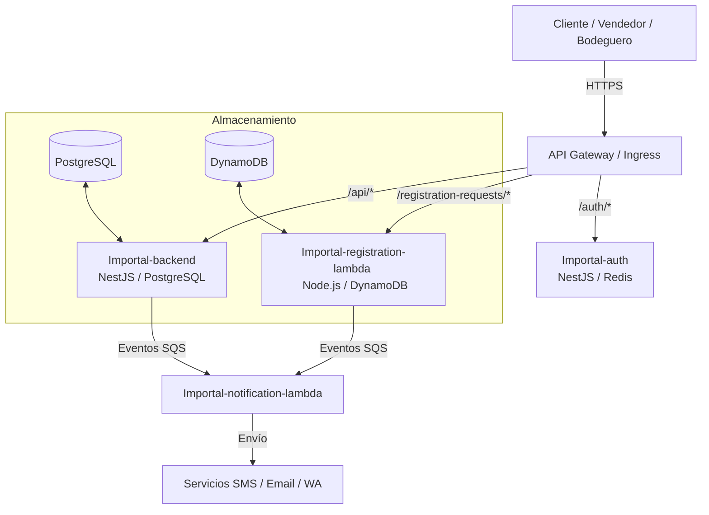

# Arquitectura Global del Sistema

Importal opera bajo una arquitectura híbrida que combina microservicios tradicionales en contenedores (NestJS) y servicios serverless orientados a eventos (AWS Lambdas), administrados mediante Infraestructura como Código (IaC).

## Componentes del Ecosistema

### 1. Aplicación Frontend (`Importal-frontend`)
La interfaz de usuario principal de la plataforma, que interactúa directamente con los endpoints expuestos por los microservicios.

### 2. Microservicio de Autenticación (`Importal-auth`)
* **Framework:** NestJS.
* **Función:** Centraliza la autenticación, generación de tokens JWT de corta duración, refresh tokens, validación de sesiones y roles de usuario.
* **Almacenamiento:** Utiliza un caché rápido en memoria (como Redis) para gestionar la invalidación de tokens activos.

### 3. Backend Core (`Importal-backend`)
* **Framework:** NestJS.
* **Función:** Aloja la lógica transaccional de negocio compleja: productos, inventario, stock, cobros, facturación periódica y control logístico.
* **Roles del Backend:**
  * `client`: Consulta catálogo, reserva stock y realiza pagos.
  * `vendedor`: Gestiona productos, confirma pedidos y solicita tránsitos de carga.
  * `bodeguero`: Gestiona el arribo de cargas y auditoría física de mercadería.
  * `admin` / `root`: Control absoluto, conciliación de pagos y cierre de cargas.
* **Almacenamiento:** PostgreSQL relacional para transaccionalidad e integridad referencial.

### 4. Lambdas de Procesamiento Asíncrono
* **`Importal-registration-lambda`**: Se ejecuta de forma serverless. Maneja las solicitudes temporales de registro para evitar saturar PostgreSQL. Almacena en DynamoDB, envía OTPs de verificación de doble factor y finalmente crea el usuario en Postgres/Auth tras la aprobación administrativa.
* **`Importal-notification-lambda`**: Consume mensajes desde colas SQS para despachar correos electrónicos, SMS o WhatsApp en segundo plano sin bloquear el flujo principal de las APIs.

### 5. Infraestructura como Código (`Importal-iac`)
Todos los recursos cloud (VPC, bases de datos RDS, tablas DynamoDB, colas SQS, buckets de S3 y políticas IAM) están versionados y administrados a través de herramientas IaC en este repositorio.
