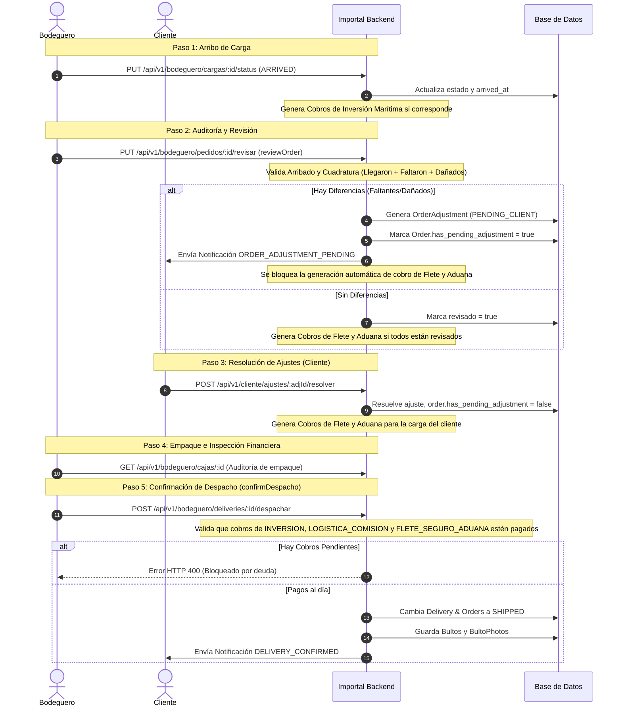

# Flujo de Trabajo de Bodega (Bodeguero Workflow)

El rol de **Bodeguero** (`UserRole.BODEGUERO`) en Importal es el encargado de la recepción física, inspección técnica, cubicación, empaque y despacho final de los productos. Este documento describe de manera exhaustiva el ciclo de vida del flujo de bodega, las validaciones de base de datos implementadas en el backend y el nuevo sistema de conciliación de diferencias financieras.

---

## Arquitectura de Código de Referencia

La lógica del flujo de bodega está implementada y coordinada en los siguientes componentes principales:

*   **Controlador de Órdenes y Entregas:** [orders.controller.ts](file:///C:/Users/joyta/OneDrive/Desktop/repos/startup/Importal/Importal-backend/src/modules/orders/controllers/orders.controller.ts)
*   **Servicio de Órdenes:** [orders.service.ts](file:///C:/Users/joyta/OneDrive/Desktop/repos/startup/Importal/Importal-backend/src/modules/orders/orders.service.ts)
*   **Entidades del Modelo de Datos:**
    *   [Carga](file:///C:/Users/joyta/OneDrive/Desktop/repos/startup/Importal/Importal-backend/src/modules/orders/entities/carga.entity.ts): Carga consolidada en tránsito o arribada.
    *   [Order](file:///C:/Users/joyta/OneDrive/Desktop/repos/startup/Importal/Importal-backend/src/modules/orders/entities/order.entity.ts): Pedidos individuales de los clientes.
    *   [OrderAdjustment](file:///C:/Users/joyta/OneDrive/Desktop/repos/startup/Importal/Importal-backend/src/modules/orders/entities/order-adjustment.entity.ts): Ajustes financieros por diferencias.
    *   [Caja](file:///C:/Users/joyta/OneDrive/Desktop/repos/startup/Importal/Importal-backend/src/modules/orders/entities/caja.entity.ts): Contenedores físicos para carga marítima.
    *   [Delivery](file:///C:/Users/joyta/OneDrive/Desktop/repos/startup/Importal/Importal-backend/src/modules/orders/entities/delivery.entity.ts): Despacho consolidado de un cliente en una carga.
    *   [Bulto](file:///C:/Users/joyta/OneDrive/Desktop/repos/startup/Importal/Importal-backend/src/modules/orders/entities/bulto.entity.ts) y [BultoPhoto](file:///C:/Users/joyta/OneDrive/Desktop/repos/startup/Importal/Importal-backend/src/modules/orders/entities/bulto-photo.entity.ts): Paquetes físicos despachados con pesos e imágenes de evidencia.
    *   [Cobro](file:///C:/Users/joyta/OneDrive/Desktop/repos/startup/Importal/Importal-backend/src/modules/billing/entities/cobro.entity.ts): Estado de cuenta y cobros financieros de los clientes.

---

## Flujo del Proceso de Bodega

A continuación se muestra el flujo secuencial que sigue una carga y sus pedidos asociados desde su arribo hasta su despacho:



---

## 1. Recepción y Arribo de la Carga

La carga logística se origina en estado `IN_TRANSIT`. Cuando el transporte físico arriba a la bodega, el Bodeguero o Administrador actualiza su estado.

*   **Endpoint:** `PUT /api/v1/bodeguero/cargas/:id/status`
*   **Método del Servicio:** `updateCargaStatus`
*   **Lógica de Negocio y Efectos:**
    1.  La carga pasa a estado `CargaStatus.ARRIVED` y se registra la marca de tiempo `arrived_at`.
    2.  Si la carga es de tipo **Marítima** (`TipoCarga.MARITIMA`), el backend ejecuta automáticamente el cálculo de inversión marítima:
        ```typescript
        await this.billingService.generateMaritimeInvestmentCharges(cargaId);
        ```
        Esto genera los cobros tipo `INVERSION` a los clientes que poseen productos de inversión marítima en dicha carga.

> [!IMPORTANT]
> **Bloqueo de Seguridad en Tránsito:**
> Para evitar errores de cuadratura en inventarios que físicamente no han llegado, el backend valida estrictamente en `reviewOrder` que la carga asociada al pedido tenga el estado `ARRIVED` o poseer un valor no nulo en su columna `arrived_at`. De lo contrario, se retorna un error `HTTP 400 Bad Request`.

---

## 2. Revisión Física y Auditoría (`reviewOrder`)

Una vez que la carga ha arribado, los productos se descargan y se auditan contra el manifiesto digital usando el método `reviewOrder`.

*   **Endpoint:** `PUT /api/v1/bodeguero/pedidos/:id/revisar`
*   **Parámetros:** `ReviewOrderDto` (`llegaron`, `faltaron`, `dañados`, `peso_cobrado_kg`, `caja_id`)

### 2.1 Ecuación de Cuadratura Física
El backend valida estrictamente que la suma de las cantidades física e incidencias coincida con la cantidad original solicitada:
$$\text{Llegaron} + \text{Faltaron} + \text{Dañados} == \text{order.total\_items}$$
Si esta ecuación no se cumple, el backend arroja un error de validación impidiendo guardar el registro.

### 2.2 Reglas de Cubicación y Peso (Aéreo vs Marítimo)

| Vía de Transporte | Campo de Peso (`peso_cobrado_kg`) | Campo de Caja (`caja_id`) | Regla Excluyente del Backend |
| :--- | :--- | :--- | :--- |
| **AÉREO** | Opcional | Opcional | Debe ingresarse el Peso **o** la Caja, pero **nunca ambos** simultáneamente. |
| **MARÍTIMO** | **Prohibido** | **Obligatorio** | Debe asociarse obligatoriamente a una caja física existente. El peso manual no aplica en marítimo. |

---

### 2.3 NUEVA LÓGICA: Conciliación de Diferencias y Ajustes

Anteriormente, cuando existían diferencias físicas severas se permitía el rechazo directo del pedido. **Actualmente, el rechazo directo de órdenes por el Bodeguero está deshabilitado ante diferencias.** En su lugar, el sistema opera con el siguiente flujo automatizado:

1.  **Detección de Incidencias:** Si el pedido se marca como revisado pero presenta faltantes o daños (`faltaron > 0 || dañados > 0`):
    *   Se marca la orden con `has_pending_adjustment = true`.
    *   La orden guarda temporalmente `order.llegaron` como la nueva cantidad física.
2.  **Generación del Ajuste (`OrderAdjustment`):** Se genera automáticamente un registro en [OrderAdjustment](file:///C:/Users/joyta/OneDrive/Desktop/repos/startup/Importal/Importal-backend/src/modules/orders/entities/order-adjustment.entity.ts) en estado `PENDING_CLIENT`.
3.  **Recálculo Financiero Automático:** El backend calcula de forma preventiva los reembolsos en CLP:
    *   **Inversión Reembolsable:** Calculada sobre la diferencia física:
        $$\text{Diferencia} = \text{Original} - \text{Llegaron}$$
        $$\text{Reembolso Inversión} = \text{Diferencia} \times \text{Precio USD} \times \text{Tasa de Cambio} \times (1 + \text{Tasa Impuesto \%})$$
    *   **Logística/Comisión Recalculada:** Se evalúa el nuevo total de compra del cliente en la carga y se recalcula su porcentaje de comisión a través de los tramos de la tabla `CommissionTier`. La diferencia entre la comisión original cobrada y la nueva comisión ajustada se asigna como `refund_comision_clp`.
4.  **Bloqueo de Cobro de Flete y Aduana:**
    *   En condiciones normales, cuando todos los pedidos de un cliente en una carga han sido marcados como `revisado = true`, se genera automáticamente el cobro logístico final (`FLETE_SEGURO_ADUANA`) llamando a `generateFleteYAduanaCobro()`.
    *   **Con la nueva lógica:** Si al verificar la carga del cliente, existe **al menos una orden** con `has_pending_adjustment = true`, **la generación del cobro de flete y aduana se pospone**.
5.  **Resolución por el Cliente:** El cliente recibe la alerta `ORDER_ADJUSTMENT_PENDING` y decide cómo resolverlo (Nota de Crédito, Deducción Directa, Reembolso por Transferencia o Trueque). Al resolverlo:
    *   El backend restablece `order.has_pending_adjustment = false`.
    *   Se reevalúan todos los pedidos de la carga para el cliente. Si ya no existen ajustes pendientes y todos están revisados, se genera y emite de inmediato el cobro de `FLETE_SEGURO_ADUANA`.

---

## 3. Bloqueo Financiero de Despacho (Anti-Mora)

Antes de autorizar la salida física de cualquier pedido de bodega, el backend implementa una validación restrictiva de pagos pendientes en el método `confirmDespacho`.

> [!WARNING]
> **Política de Cero Deuda en Despacho:**
> Al intentar despachar una entrega (`Delivery`), el sistema consulta todos los cobros vigentes del cliente asociados a la carga actual.
> *   **Tipos de Cobro Auditados:** `INVERSION`, `LOGISTICA_COMISION` y `FLETE_SEGURO_ADUANA`.
> *   **Criterio de Bloqueo:** Si **al menos uno** de estos cobros posee un estado distinto de `CobroStatus.CONFIRMED` (por ejemplo, `PENDING`, `OVERDUE` o `RETRY`), la transacción es cancelada arrojando un error `HTTP 400 Bad Request`:
>     > *"El cliente tiene cobros pendientes en esta carga: [Tipos]. Debe estar pagado para poder despachar."*

---

## 4. Empaque en Cajas (Carga Marítima)

Para el transporte marítimo, es obligatorio el uso de cajas físicas que permitan consolidar el volumen de los clientes.

*   **Creación de Cajas:** El bodeguero registra cajas en base de datos (`POST /api/v1/bodeguero/cajas`) especificando el cliente, la carga y la talla/tamaño de la caja (`caja_size`: S, M, L, XL).
*   **Costos Logísticos:** El backend asocia automáticamente cada talla de caja con las tarifas vigentes de flete registradas en el sistema.
*   **Auditoría de Cajas:** A través del endpoint `GET /api/v1/bodeguero/cajas/:id`, el bodeguero audita las órdenes asignadas a esa caja, su peso total y genera el empaque final.

---

## 5. Confirmación de Despacho (`confirmDespacho`)

Una vez que se han verificado los pagos y los productos están embalados, se realiza el despacho físico de los paquetes.

*   **Endpoint:** `POST /api/v1/bodeguero/deliveries/:id/despachar`
*   **Controlador:** `confirmDespacho(req, id, dto)` en `orders.controller.ts`
*   **Payload de Entrada (`ConfirmDespachoDto`):**
    ```json
    {
      "video_ref_info": "Cámara principal - Grabación de Sellado",
      "camera_id": "CAM-04-DESPACHO",
      "carrier_proof_url": "https://s3.amazonaws.com/importal-proofs/guia-transportista-9812.pdf",
      "bultos": [
        {
          "bulto_number": 1,
          "weight_kg": 14.5,
          "photos": [
            "https://s3.amazonaws.com/importal-proofs/bulto-1-photo1.jpg"
          ]
        }
      ]
    }
    ```

### 5.1 Cambios en Base de Datos tras el Despacho
Cuando se valida que la entrega no posee deudas y se procesa exitosamente:
1.  **Estado de Entrega:** El registro de [Delivery](file:///C:/Users/joyta/OneDrive/Desktop/repos/startup/Importal/Importal-backend/src/modules/orders/entities/delivery.entity.ts) cambia su estado a `DeliveryStatus.SHIPPED` y se guardan metadatos como `dispatched_at` y `dispatched_by_id`.
2.  **Registro de Bultos:** Se registran los elementos en [Bulto](file:///C:/Users/joyta/OneDrive/Desktop/repos/startup/Importal/Importal-backend/src/modules/orders/entities/bulto.entity.ts) y sus respectivas evidencias fotográficas en [BultoPhoto](file:///C:/Users/joyta/OneDrive/Desktop/repos/startup/Importal/Importal-backend/src/modules/orders/entities/bulto-photo.entity.ts).
3.  **Estado de Pedidos:** Todas las órdenes del cliente en esa carga específica que no estén canceladas o rechazadas cambian su estado a `OrderStatus.SHIPPED` y se vinculan al primer bulto físico generado (`order.bulto_id`).
4.  **Notificación al Cliente:** Se dispara un evento asíncrono que consume la lambda de notificaciones (`Importal-notification-lambda`) enviando una alerta de tipo `DELIVERY_CONFIRMED` al cliente:
    > *"Su envío para la carga #XX ha sido despachado física y exitosamente."*
