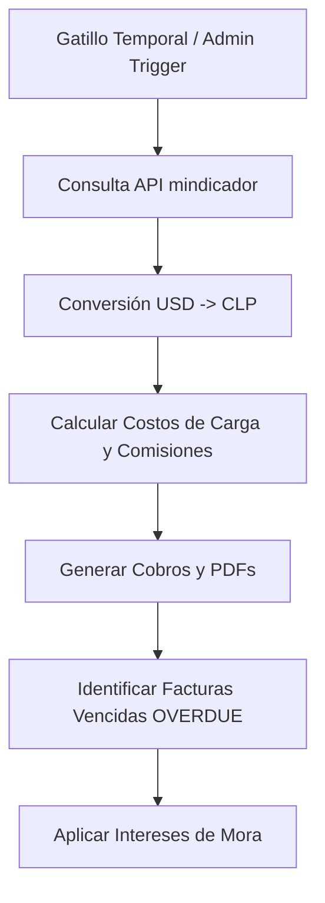

# Trabajos Internos y Reglas de Negocio (Cron & Backend Jobs)

La estabilidad financiera y logística de Importal depende de procesos programados en segundo plano (Cron Jobs) y reglas de validación complejas ejecutadas directamente en el backend de NestJS.

---

## 1. Facturación Periódica y Gestión de Moras

El backend incluye un scheduler interno (o eventos externos de CloudWatch) que ejecutan procesos contables automatizados:

### Conversión de Monedas (`mindicador.cl`)
Dado que la mercadería y costos internacionales se gestionan en Dólares Estadounidenses (USD), pero los clientes e inversores pagan localmente en Pesos Chilenos (CLP):
1. El sistema realiza una llamada HTTP externa a la API de **mindicador.cl** para obtener el tipo de cambio oficial del día.
2. Almacena este valor y lo utiliza para calcular la conversión exacta de comisiones, fletes y bodegaje.

### Procesamiento de Intereses y Moras
* **Detección:** El job identifica cobros cuyo estado es `PENDING` y cuya fecha de vencimiento (`dueDate`) es anterior a la fecha actual.
* **Transición de Estado:** Estos cobros pasan automáticamente al estado `OVERDUE`.
* **Cálculo de Recargo:** Se aplica una tasa de interés diaria configurada en la base de datos sobre el saldo insoluto, regenerando el balance total del cobro y actualizando el PDF adjunto.

---

## 2. Reglas de Negocio de Vendedores y Logística

Existen reglas estrictas implementadas a nivel de base de datos y validación de endpoints para evitar demoras y deudas incobrables en el marketplace:

### Bloqueo de Publicación de Productos
Para garantizar que los vendedores entreguen a tiempo los pedidos de cargas pasadas:
* **Regla:** Si un vendedor tiene algún pedido con estado `PENDING` asociado a una carga que ha sido cerrada oficialmente (`status = 'CLOSED'`), el sistema le **bloqueará la creación de nuevos productos**.
* **Efecto:** Cualquier llamada a `POST /api/v1/vendedor/productos` por parte de este vendedor lanzará un error `400 BadRequestException` impidiendo la publicación hasta que resuelva sus órdenes pendientes.

### Transición de Carga por Cierre Administrativo
Cuando el administrador cierra oficialmente una carga en destino (`POST /api/v1/admin/cargas/{id}/close`):
1. **Desactivación de Productos:** Todos los productos de los vendedores que estaban asignados a esa carga cerrada se desactivan temporalmente para evitar nuevas compras mientras se reorganiza el transporte.
2. **Generación de Cobros:** Se cierran las cuentas y se calculan las comisiones de logística correspondientes a los metros cúbicos o peso total utilizado.
3. **Transición Automática:** Los vendedores deben migrar a la nueva carga abierta. Si no tienen órdenes pendientes en la carga cerrada, la asignación a la nueva carga abierta se procesa automáticamente al llamar a `/api/v1/vendedor/cargas/transicion-cierre`.

### Reserva y Devolución Inmediata de Stock
* **Creación del Pedido:** Cuando un cliente realiza una orden, el stock del producto disminuye **inmediatamente** en modo "reserva".
* **Confirmación:** Al ser confirmado por el vendedor, la reserva se consolida.
* **Rechazo o Cancelación:** Si el vendedor rechaza la orden (falta de stock real o problema de envío) o el cliente la cancela, la base de datos revierte la operación y devuelve automáticamente las unidades al stock público del producto.
