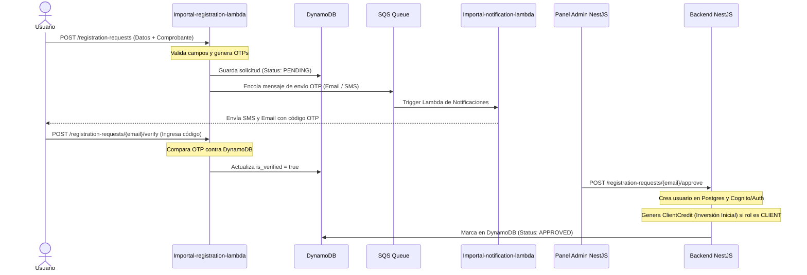

# Registro y Lambdas (Serverless)

Para optimizar costos, mejorar el rendimiento y evitar la persistencia de usuarios basura o spam en la base de datos relacional PostgreSQL, Pascalle Store utiliza un flujo de registro serverless basado en AWS Lambdas y bases de datos NoSQL.

## Flujo de Registro de Usuarios

El registro de nuevos clientes, inversores o bodegueros se gestiona temporalmente fuera del backend NestJS principal:

---

## Servicios Involucrados

### 1. `Importal-registration-lambda`
* **Tecnología:** Node.js.
* **Propósito:** Actúa como el primer punto de contacto para nuevos registros.
* **Almacenamiento Temporal:** Lee y escribe en una tabla de **Amazon DynamoDB**. Almacena la contraseña hasheada, datos personales, la firma del consentimiento y los metadatos del comprobante de transferencia subido.
* **Verificación de Doble Canal (2FA):** 
  * Genera dos códigos OTP independientes (uno para correo electrónico y otro para teléfono móvil).
  * Cuando el usuario ingresa el código correcto en cada canal, actualiza `is_email_verified` y `is_phone_verified`.
  * La solicitud sólo queda lista para revisión administrativa cuando ambos canales están validados (`is_verified = true`).

### 2. `Importal-notification-lambda`
* **Tecnología:** Node.js.
* **Propósito:** Suscrita a colas de Amazon SQS (Simple Queue Service) para procesar de manera asíncrona todos los envíos de notificaciones.
* **Canales Soportados:**
  * **Email:** Envío de correos transaccionales (OTP, confirmación de pagos, facturas en PDF).
  * **SMS:** Códigos rápidos de autenticación móvil.
  * **WhatsApp:** Alertas de estado logístico ("Tu carga ha arribado a Santiago").

---

## Crédito de Inversión Inicial al Registro

Al momento de que un administrador aprueba una solicitud de registro (`POST /registration-requests/{email}/approve`), si el rol asignado al usuario es `CLIENT`, el backend de Pascalle Store genera automáticamente un crédito de inversión inicial.

### Reglas de Negocio
* **1 sala (tipo de transporte):** Si el cliente seleccionó solo 1 tipo de transporte (aéreo o marítimo), se le otorga un crédito de **$50.000 CLP**.
* **2 salas (tipos de transporte):** Si el cliente seleccionó ambos tipos de transporte (aéreo y marítimo), se le otorga un crédito de **$100.000 CLP**.

### Registro en Base de Datos
Este crédito se persiste en la tabla `client_credits` mapeado bajo la entidad `ClientCredit` con la siguiente lógica:
* **`client_id`**: Referencia al ID único del cliente aprobado en la tabla `users` (`saved.id`).
* **`amount_clp`**: Monto asignado ($50.000 o $100.000 CLP según la cantidad de salas).
* **`remaining_amount_clp`**: Inicializado con el mismo valor que `amount_clp`.
* **`notes`**: Texto descriptivo que indica la inversión inicial y el número de salas seleccionadas (ej. `Inversión inicial - Registro de cliente (X salas)`).
* **`order_adjustment_id`**: Se inicializa en `null`.

---

## Ventajas de este Diseño
1. **Protección de Base de Datos Core:** PostgreSQL solo almacena cuentas validadas y activas. El spam y registros inconclusos mueren por TTL en DynamoDB.
2. **Desacoplamiento Financiero:** La subida de comprobantes de pago pesados en Base64 se guarda directamente en buckets de Amazon S3 temporales mediante URLs firmadas, sin consumir ancho de banda de la base de datos PostgreSQL.
3. **Escalabilidad:** SQS absorbe los picos de tráfico de notificaciones durante cierres de cargas o campañas de facturación periódica.
