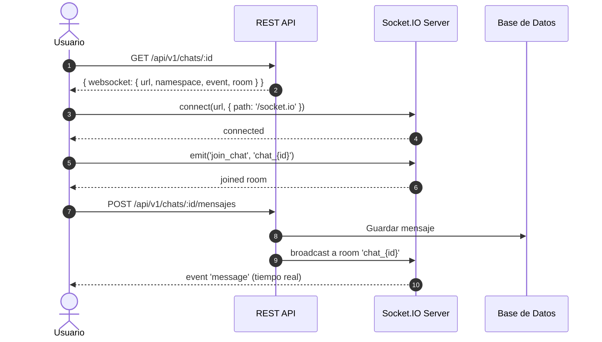

# Mensajería (Chats)

El módulo de mensajería de Pascalle Store permite la comunicación en tiempo real entre los participantes del ecosistema (Clientes, Vendedores, Bodegueros y Administradores) a través de canales de chat organizados por sala de transporte.

---

## Resumen de Endpoints

| Método | Ruta | Roles Permitidos | Descripción |
| :--- | :--- | :--- | :--- |
| `GET` | `/api/v1/chats` | Todos los roles | Listar chats disponibles para el usuario. |
| `GET` | `/api/v1/chats/:id/mensajes` | Todos los roles | Listar mensajes paginados de un chat. |
| `POST` | `/api/v1/chats/:id/mensajes` | Todos los roles | Enviar un mensaje a un chat. |

---

## 1. Canales de Chat

### 1.1 Listar Chats Disponibles

Devuelve los canales de chat a los que tiene acceso el usuario autenticado, filtrados según su rol y los tipos de sala/transporte habilitados en su token.

- **Método:** `GET`
- **Ruta:** `/api/v1/chats`
- **Roles Permitidos:** `ADMIN`, `CLIENT`, `VENDOR`, `BODEGUERO`, `ROOT`
- **Respuesta Exitosa (200 OK):** Array de chats accesibles.

> [!NOTE]
> **Anonimización del Cliente ('Cliente #id') y Minimización de Nombres (Ley N° 21.719):**
> Cuando el usuario asociado a la conversación posee el rol `CLIENT`, su nombre en pantalla se sustituye por `Cliente #<user_id>` (ej. `Cliente #18`) para proteger la PII del titular ante otros participantes. Para usuarios no clientes (`VENDOR`, `BODEGUERO`, `ADMIN`, `ROOT`), el campo `chat.user.name` se recorta aplicando el principio de minimización de datos para retornar únicamente el **primer nombre** (`name.trim().split(' ')[0]`). Los datos de contacto sensibles (`rut`, `email_address`, `phone_number`) se omiten estrictamente.

> [!NOTE]
> **Aislamiento Exclusivo de Conversaciones para Vendedores (`role: vendor`):**
> Cuando un usuario con rol `VENDOR` consulta `GET /api/v1/chats`, el sistema filtra y retorna de manera exclusiva los chats pertenecientes a su propio identificador (`chat.user_id === userId`), garantizando confidencialidad y aislamiento de datos entre proveedores.

> [!NOTE]
> **Filtrado por Transporte:**
> El backend extrae los tipos de transporte autorizados tanto del payload del JWT como del header `Authorization`. Para clientes y bodegueros, el chat solo se muestra si el tipo de transporte del canal coincide con al menos uno de los transportes habilitados para ese usuario.

---

## 2. Mensajes

### 2.1 Listar Mensajes del Chat

Obtiene el historial de mensajes de un canal de chat, paginados en orden cronológico.

- **Método:** `GET`
- **Ruta:** `/api/v1/chats/:id/mensajes`
- **Roles Permitidos:** `ADMIN`, `CLIENT`, `VENDOR`, `BODEGUERO`, `ROOT`
- **Path Parameters:**
  - `id` (número, requerido): ID del chat.
- **Query Parameters:**
  - `page` (opcional, default `1`): Número de página (mensajes más recientes primero).
- **Respuesta Exitosa (200 OK):**
  ```json
  {
    "data": [
      {
        "id": 101,
        "chat_id": 3,
        "message": "¿Cuándo llega la próxima carga aérea?",
        "sender_name": "María",
        "sender_id": "18",
        "created_at": "2026-07-15T14:30:00.000Z",
        "referenced_message_id": null
      }
    ],
    "meta": {
      "page": 1,
      "total": 50
    }
  }
  ```

### 2.2 Enviar Mensaje

Publica un nuevo mensaje en el canal de chat especificado.

- **Método:** `POST`
- **Ruta:** `/api/v1/chats/:id/mensajes`
- **Roles Permitidos:** `ADMIN`, `CLIENT`, `VENDOR`, `BODEGUERO`, `ROOT`
- **Path Parameters:**
  - `id` (número, requerido): ID del chat.
- **Cuerpo de la Petición (JSON):**
  ```json
  {
    "message": "El pedido #145 ya fue revisado en bodega.",
    "referenced_message_id": 100
  }
  ```
  - `message` (string, requerido): Contenido del mensaje.
  - `referenced_message_id` (número, opcional): ID del mensaje al que se responde (para hilos de conversación).
- **Respuesta Exitosa (201 Created):** Devuelve el mensaje creado.

> [!NOTE]
> **Identidad del Remitente:**
> El nombre del remitente se extrae automáticamente del token JWT (`app_full_name`, `app_username` o `name`). El ID del remitente también se obtiene del token, por lo que no es necesario enviarlo en el cuerpo de la petición.

---

## 3. Arquitectura del Sistema de Mensajería


