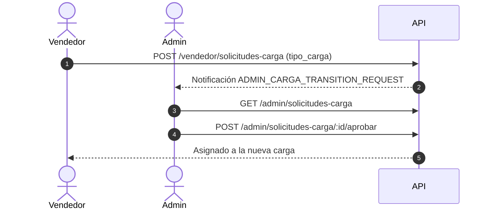

# Pedidos y Cargas

Esta sección documenta el ciclo de vida completo de los pedidos y cargas de importación en Pascalle Store, desde la creación de una carga hasta el despacho final al cliente.

---

## Resumen de Endpoints

### Cargas (Acceso General)
| Método | Ruta | Roles Permitidos | Descripción |
| :--- | :--- | :--- | :--- |
| `GET` | `/api/v1/cargas` | Todos | Listar cargas con filtros. |
| `GET` | `/api/v1/cargas/:id` | Todos | Detalle de una carga. |

### Admin — Cargas y Solicitudes
| Método | Ruta | Roles Permitidos | Descripción |
| :--- | :--- | :--- | :--- |
| `POST` | `/api/v1/admin/cargas` | `ADMIN`, `ROOT` | Crear nueva carga. |
| `POST` | `/api/v1/admin/cargas/:id/close` | `ADMIN`, `ROOT` | Cerrar una carga. |
| `PUT` | `/api/v1/admin/cargas/:id/llegada` | `ADMIN`, `ROOT` | Registrar llegada de carga. |
| `GET` | `/api/v1/admin/solicitudes-carga` | `ADMIN`, `ROOT` | Listar solicitudes de transición. |
| `GET` | `/api/v1/admin/solicitudes-carga/:id` | `ADMIN`, `ROOT` | Detalle de solicitud de transición. |
| `POST` | `/api/v1/admin/solicitudes-carga/:id/aprobar` | `ADMIN`, `ROOT` | Aprobar solicitud de transición. |
| `POST` | `/api/v1/admin/solicitudes-carga/:id/rechazar` | `ADMIN`, `ROOT` | Rechazar solicitud de transición. |
| `GET` | `/api/v1/admin/deliveries` | `ADMIN`, `ROOT` | Listar deliveries con filtros. |
| `POST` | `/api/v1/admin/deliveries/:id/confirmar-entrega` | `ADMIN`, `ROOT` | Confirmar entrega manualmente. |

### Vendedor — Pedidos y Cargas
| Método | Ruta | Roles Permitidos | Descripción |
| :--- | :--- | :--- | :--- |
| `GET` | `/api/v1/vendedor/pedidos` | `VENDOR` | Listar pedidos del vendedor. |
| `GET` | `/api/v1/vendedor/pedidos/:id` | `VENDOR` | Detalle de un pedido. |
| `GET` | `/api/v1/vendedor/pedidos-carga/status` | `VENDOR` | Estado de carga actual del vendedor. |
| `POST` | `/api/v1/vendedor/pedidos/:id/confirmar` | `VENDOR` | Confirmar pedido. |
| `POST` | `/api/v1/vendedor/pedidos/:id/rechazar` | `VENDOR` | Rechazar pedido. |
| `PUT` | `/api/v1/vendedor/pedidos/:id/estado` | `VENDOR` | Actualizar estado del pedido. |
| `POST` | `/api/v1/vendedor/pedidos/:id/envio` | `VENDOR` | Marcar pedido como enviado. |
| `POST` | `/api/v1/vendedor/pedidos/:id/solicitar-transicion` | `VENDOR` | Solicitar transición de carga. |
| `POST` | `/api/v1/vendedor/solicitudes-carga` | `VENDOR` | Crear solicitud de transición. |
| `GET` | `/api/v1/vendedor/solicitudes-carga` | `VENDOR` | Listar solicitudes propias. |
| `GET` | `/api/v1/vendedor/solicitudes-carga/:id` | `VENDOR` | Detalle de solicitud propia. |
| `POST` | `/api/v1/vendedor/cargas/transicion-cierre` | `VENDOR` | Transición a carga cerrada. |

### Cliente — Pedidos y Deliveries
| Método | Ruta | Roles Permitidos | Descripción |
| :--- | :--- | :--- | :--- |
| `GET` | `/api/v1/cliente/pedidos` | `CLIENT` | Listar pedidos del cliente. |
| `GET` | `/api/v1/cliente/pedidos/:id` | `CLIENT` | Detalle de un pedido. |
| `POST` | `/api/v1/cliente/pedidos` | `CLIENT` | Crear nuevo pedido. |
| `GET` | `/api/v1/cliente/deliveries` | `CLIENT` | Listar deliveries del cliente. |
| `GET` | `/api/v1/cliente/deliveries/:id` | `CLIENT` | Detalle de un delivery. |
| `POST` | `/api/v1/cliente/deliveries/:id/solicitar-envio` | `CLIENT` | Solicitar despacho de delivery. |
| `POST` | `/api/v1/cliente/deliveries/:id/confirmar-entrega` | `CLIENT` | Confirmar recepción de delivery. |

### Bodeguero — Inventario y Pedidos
| Método | Ruta | Roles Permitidos | Descripción |
| :--- | :--- | :--- | :--- |
| `POST` | `/api/v1/bodeguero/inventario` | `BODEGUERO`, `ADMIN`, `ROOT` | Crear entrada de inventario. |
| `GET` | `/api/v1/bodeguero/inventario` | `BODEGUERO`, `ADMIN`, `ROOT` | Listar inventario de bodega. |
| `PUT` | `/api/v1/bodeguero/inventario/:id` | `BODEGUERO`, `ADMIN`, `ROOT` | Actualizar entrada de inventario. |
| `DELETE` | `/api/v1/bodeguero/inventario/:id` | `BODEGUERO`, `ADMIN`, `ROOT` | Desactivar (soft-delete) una entrada de inventario. |
| `GET` | `/api/v1/bodeguero/pedidos` | `BODEGUERO`, `ADMIN`, `ROOT` | Listar pedidos de bodega (filtros por cliente, carga y `excludeDelivered`). |

---

## 1. Cargas de Importación

### 1.1 Listar Cargas (Todos los Roles)

- **Método:** `GET`
- **Ruta:** `/api/v1/cargas`
- **Roles Permitidos:** `ADMIN`, `ROOT`, `CLIENT`, `VENDOR`, `BODEGUERO`
- **Query Parameters:**
  - `page` (opcional): Número de página.
  - `limit` (opcional): Registros por página.
  - `status` (opcional, string): Estado de la carga (ej. `OPEN`, `CLOSED`, `ARRIVED`, `PROCESSED`).
  - `sala` (opcional, string): Tipo de sala/transporte (`AEREA`, `MARITIMA`).

### 1.2 Detalle de Carga

- **Método:** `GET`
- **Ruta:** `/api/v1/cargas/:id`
- **Roles Permitidos:** `ADMIN`, `ROOT`, `CLIENT`, `VENDOR`, `BODEGUERO`

### 1.3 Crear Carga (Admin)

- **Método:** `POST`
- **Ruta:** `/api/v1/admin/cargas`
- **Roles Permitidos:** `ADMIN`, `ROOT`
- **Cuerpo (JSON):** `CreateCargaDto`
  ```json
  {
    "tipo_carga": "MARITIMA",
    "sala": "MARITIMA",
    "fecha_estimada_llegada": "2026-08-15"
  }
  ```
- **Respuesta:** `201 Created` con la carga creada.

### 1.4 Cerrar Carga (Admin)

- **Método:** `POST`
- **Ruta:** `/api/v1/admin/cargas/:id/close`
- **Roles Permitidos:** `ADMIN`, `ROOT`
- **Respuesta:** `200 OK`

### 1.5 Registrar Llegada de Carga (Admin)

- **Método:** `PUT`
- **Ruta:** `/api/v1/admin/cargas/:id/llegada`
- **Roles Permitidos:** `ADMIN`, `ROOT`
- **Cuerpo (JSON):** `UpdateCargaLlegadaDto` (fecha real de llegada y detalles logísticos).

---

## 2. Solicitudes de Transición de Carga

Cuando una carga se cierra, los vendedores deben solicitar ser asignados a la próxima carga activa.

### 2.1 Flujo de Solicitud



### 2.2 Crear Solicitud (Vendedor)

- **Método:** `POST`
- **Ruta:** `/api/v1/vendedor/solicitudes-carga`
- **Roles Permitidos:** `VENDOR`
- **Cuerpo (JSON):** `{ "tipo_carga": "MARITIMA" }`

### 2.3 Listar Solicitudes Propias (Vendedor)

- **Método:** `GET`
- **Ruta:** `/api/v1/vendedor/solicitudes-carga`
- **Roles Permitidos:** `VENDOR`

### 2.4 Detalle de Solicitud (Vendedor / Admin)

- **Método:** `GET`
- **Rutas:**
  - `/api/v1/vendedor/solicitudes-carga/:id` (VENDOR — solo sus solicitudes)
  - `/api/v1/admin/solicitudes-carga/:id` (ADMIN, ROOT — cualquier solicitud)

### 2.5 Aprobar / Rechazar Solicitud (Admin)

- `POST /api/v1/admin/solicitudes-carga/:id/aprobar` — Aprueba la solicitud y asigna al vendedor a la nueva carga.
- `POST /api/v1/admin/solicitudes-carga/:id/rechazar` — Rechaza la solicitud.

### 2.6 Transición a Carga Cerrada (Vendedor)

Permite al vendedor indicar que acepta continuar operando dentro de una carga que ya fue cerrada por el admin.

- **Método:** `POST`
- **Ruta:** `/api/v1/vendedor/cargas/transicion-cierre`
- **Roles Permitidos:** `VENDOR`
- **Cuerpo (JSON):** `{ "tipo_carga": "AEREA" }`

---

## 3. Pedidos del Vendedor

### 3.1 Listar Pedidos

- **Método:** `GET`
- **Ruta:** `/api/v1/vendedor/pedidos`
- **Query Parameters:**
  - `can_ship` (booleano string, `true`/`false`): Filtrar pedidos listos para envío.
  - `active_carga` (booleano string): Solo pedidos en carga activa.
  - `tipo_carga` (string): Tipo de carga (`AEREA`, `MARITIMA`).
  - `status` (string): Estado del pedido.
  - `page` / `limit`: Paginación.

### 3.2 Detalle de Pedido

- **Método:** `GET`
- **Ruta:** `/api/v1/vendedor/pedidos/:id`

### 3.3 Confirmar / Rechazar Pedido

- `POST /api/v1/vendedor/pedidos/:id/confirmar` — Acepta el pedido del cliente.
- `POST /api/v1/vendedor/pedidos/:id/rechazar` — Declina el pedido.

### 3.4 Actualizar Estado del Pedido

- **Método:** `PUT`
- **Ruta:** `/api/v1/vendedor/pedidos/:id/estado`
- **Cuerpo (JSON):** `UpdateOrderStatusDto` (`status: string`).

### 3.5 Marcar como Enviado

- **Método:** `POST`
- **Ruta:** `/api/v1/vendedor/pedidos/:id/envio`

### 3.6 Estado de Carga del Vendedor

- **Método:** `GET`
- **Ruta:** `/api/v1/vendedor/pedidos-carga/status`
- **Query Parameters:**
  - `tipo_carga` (opcional): `AEREA` o `MARITIMA`.

---

## 4. Pedidos del Cliente

### 4.1 Listar Pedidos

- **Método:** `GET`
- **Ruta:** `/api/v1/cliente/pedidos`
- **Query Parameters:**
  - `page` / `limit`: Paginación.
  - `vendor` (string): Filtrar por vendedor.
  - `carga` (número): Filtrar por ID de carga.
  - `status` (string): Estado del pedido.

### 4.2 Crear Pedido

- **Método:** `POST`
- **Ruta:** `/api/v1/cliente/pedidos`
- **Cuerpo (JSON):** `CreateOrderDto`
  ```json
  {
    "product_id": 42,
    "quantity": 3,
    "size": "M",
    "carga_id": 15
  }
  ```
- **Respuesta:** `201 Created` con `{ "ok": true, "orderId": 201 }`.

> [!NOTE]
> El tipo de transporte permitido para el pedido se valida automáticamente contra los tipos de sala autorizados en el token JWT del cliente.

### 4.3 Detalle de Pedido

- **Método:** `GET`
- **Ruta:** `/api/v1/cliente/pedidos/:id`

### 4.4 Deliveries del Cliente

- `GET /api/v1/cliente/deliveries` — Listar deliveries (`status`, `page`, `limit`).
- `GET /api/v1/cliente/deliveries/:id` — Detalle de un delivery.

### 4.5 Solicitar Despacho

- **Método:** `POST`
- **Ruta:** `/api/v1/cliente/deliveries/:id/solicitar-envio`
- **Cuerpo (JSON):** `RequestDeliveryShippingDto` (dirección de despacho, instrucciones).

### 4.6 Confirmar Recepción

- **Método:** `POST`
- **Ruta:** `/api/v1/cliente/deliveries/:id/confirmar-entrega`
- **Respuesta:** `200 OK` — Delivery marcado como `DELIVERED`.

---

## 5. Inventario de Bodega

CRUD de ítems operativos de bodega usados principalmente para trueques (`BARTER_NEGOTIATION`), no para el catálogo público de ventas. Sigue el mismo patrón de `vendedor/productos` (creador asignado automáticamente vía JWT, `DELETE` como soft-delete que cambia `status` en vez de borrar la fila), salvo que **no hay restricción de dueño** en `UPDATE`/`DELETE`: cualquier `BODEGUERO`/`ADMIN`/`ROOT` puede editar o desactivar cualquier ítem, ya que es un recurso compartido entre turnos, no un catálogo personal.

### 5.1 Crear Entrada de Inventario

- **Método:** `POST`
- **Ruta:** `/api/v1/bodeguero/inventario`
- **Roles Permitidos:** `BODEGUERO`, `ADMIN`, `ROOT`
- **Cuerpo (JSON):** `CreateWarehouseInventoryDto`
- **Respuesta:** `201 Created`. Se crea siempre en `status: "ACTIVE"`, con `registered_by_id` tomado del JWT.

### 5.2 Listar Inventario

- **Método:** `GET`
- **Ruta:** `/api/v1/bodeguero/inventario`
- **Roles Permitidos:** `BODEGUERO`, `ADMIN`, `ROOT`
- **Query Parameters:** `GetWarehouseInventoryQueryDto` — `name`, `sku`, `status` (`ACTIVE`/`INACTIVE`, opcional; sin filtro retorna todos los estados), `page`/`limit` (paginado).

### 5.3 Actualizar Entrada de Inventario

- **Método:** `PUT`
- **Ruta:** `/api/v1/bodeguero/inventario/:id`
- **Cuerpo (JSON):** `UpdateWarehouseInventoryDto` (`stock`, `location`).

### 5.4 Eliminar (Desactivar) Entrada de Inventario

- **Método:** `DELETE`
- **Ruta:** `/api/v1/bodeguero/inventario/:id`
- **Roles Permitidos:** `BODEGUERO`, `ADMIN`, `ROOT`
- **Respuesta:** `200 OK` — `{ "ok": true }`. Soft-delete: marca `status = "INACTIVE"` en lugar de borrar la fila, porque pedidos de trueque (`Order.warehouse_inventory_id`) pueden referenciar el ítem y esa FK no tiene `ON DELETE CASCADE`/`SET NULL` configurado.
- **Errores:** `404` si el ítem no existe.

### 5.5 Listar Pedidos de Bodega

Devuelve los pedidos de cargas ya arribadas (`ARRIVED`), con las relaciones `product`, `carga`, `cajas` y `client`. Reemplaza al antiguo endpoint `GET /bodeguero/ordenes-fisicas` (removido), que tenía la misma lógica de filtrado duplicada.

- **Método:** `GET`
- **Ruta:** `/api/v1/bodeguero/pedidos`
- **Roles Permitidos:** `BODEGUERO`, `ADMIN`, `ROOT`
- **Query Parameters:**
  - `clientId` (opcional, número): Filtrar por cliente.
  - `cargaId` (opcional, número): Filtrar por carga.
  - `excludeDelivered` (opcional, booleano `true`/`1`): Además de excluir siempre `CANCELLED`/`REJECTED`, excluye también `DELIVERED`. Úsalo para obtener solo los pedidos físicamente pendientes de despacho — este es el caso de uso que antes cubría `ordenes-fisicas`, ej. `GET /api/v1/bodeguero/pedidos?excludeDelivered=true`.

> [!TIP]
> Para el flujo completo de bodega (recepción, revisión, empaque y despacho), consulta la [Guía de Flujo de Bodega](./bodeguero-workflow).
