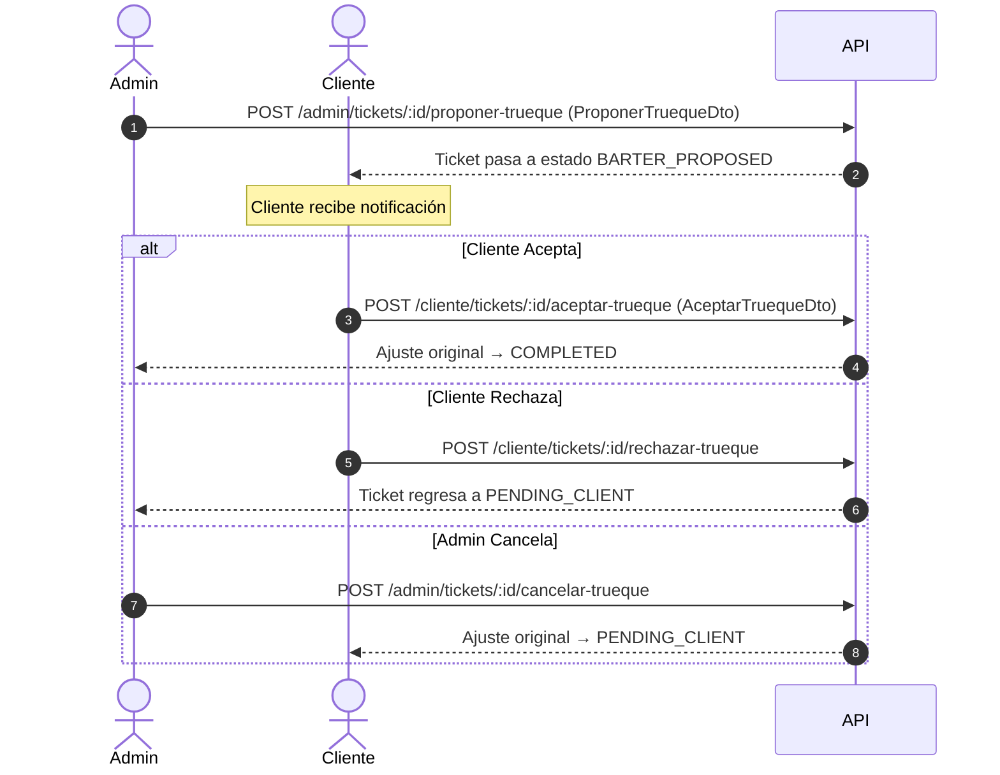

# Tickets de Soporte

Este módulo documenta el sistema de tickets de soporte de Pascalle Store, disponible para todos los roles de usuario. Permite reportar incidencias, gestionar trueques y solicitar acceso a salas de transporte (aérea o marítima).

---

## Resumen de Endpoints

| Módulo | Método | Ruta | Roles Permitidos | Descripción |
| :--- | :--- | :--- | :--- | :--- |
| **Tickets** | `POST` | `/api/v1/soporte/tickets` | Todos | Crear un nuevo ticket de soporte. |
| **Tickets** | `GET` | `/api/v1/soporte/tickets` | Todos | Listar tickets propios con filtros opcionales. |
| **Tickets** | `GET` | `/api/v1/soporte/tickets/:id` | Todos | Obtener detalle de un ticket propio. |
| **Cliente** | `POST` | `/api/v1/cliente/tickets/:id/aceptar-trueque` | `CLIENT` | Aceptar la propuesta de trueque del admin. |
| **Cliente** | `POST` | `/api/v1/cliente/tickets/:id/rechazar-trueque` | `CLIENT` | Rechazar la propuesta de trueque del admin. |
| **Cliente** | `POST` | `/api/v1/cliente/solicitud-transporte` | `CLIENT` | Solicitar acceso a una sala de transporte (con comprobante). |
| **Vendedor** | `POST` | `/api/v1/vendedor/solicitud-transporte` | `VENDOR` | Solicitar acceso a una sala de transporte. |
| **Admin** | `GET` | `/api/v1/admin/tickets` | `ADMIN`, `ROOT` | Bandeja de entrada unificada de tickets. |
| **Admin** | `PUT` | `/api/v1/admin/soporte/tickets/:id/resolucion` | `ADMIN`, `ROOT` | Resolver un ticket. |
| **Admin** | `POST` | `/api/v1/admin/tickets/:id/resolver` | `ADMIN`, `ROOT` | Alias: Resolver un ticket. |
| **Admin** | `POST` | `/api/v1/admin/tickets/:id/proponer-trueque` | `ADMIN`, `ROOT` | Proponer un producto de trueque al cliente. |
| **Admin** | `GET` | `/api/v1/admin/trueques/productos-bodega`<br>`/api/v1/admin/tickets/productos-bodega`<br>`/api/v1/admin/soporte/productos-bodega` | `ADMIN`, `ROOT` | Listar productos de bodega para trueque (filtro query `talla`, retorna `sizes: Array<{ id, talla, stock }>`). |
| **Admin** | `POST` | `/api/v1/admin/tickets/:id/resolver-transporte` | `ADMIN`, `ROOT` | Aprobar o rechazar solicitud de transporte. |
| **Admin** | `POST` | `/api/v1/admin/tickets/:id/cancelar-trueque` | `ADMIN`, `ROOT` | Cancelar la propuesta de trueque activa. |

---

## 1. Tickets de Usuario (Todos los Roles)

### 1.1 Crear Ticket de Soporte

Permite a cualquier usuario autenticado crear un ticket de soporte para reportar una incidencia.

- **Método:** `POST`
- **Ruta:** `/api/v1/soporte/tickets`
- **Roles Permitidos:** `CLIENT`, `VENDOR`, `BODEGUERO`, `ADMIN`, `ROOT`
- **Cuerpo de la Petición (JSON):** `CreateSupportTicketDto`
  ```json
  {
    "type": "SUPPORT",
    "subject": "Producto dañado en mi pedido #145",
    "description": "El artículo llegó con daños visibles en el empaque y no funciona correctamente.",
    "order_id": 145
  }
  ```
- **Respuesta Exitosa (201 Created):** Devuelve el ticket creado.

> [!NOTE]
> **Tipos de Ticket (`type`):**
> - `SUPPORT`: Soporte técnico o incidencia general.
> - `TRADE`: Solicitud de trueque (cambio de producto).
> - `REFUND_TRANSFER`: Reembolso por transferencia bancaria.
> - `ADD_TRANSPORT_REQUEST`: Solicitud de acceso a sala de transporte.

### 1.2 Listar Tickets Propios

Obtiene todos los tickets creados por el usuario autenticado, con filtros opcionales.

- **Método:** `GET`
- **Ruta:** `/api/v1/soporte/tickets`
- **Roles Permitidos:** `CLIENT`, `VENDOR`, `BODEGUERO`, `ADMIN`, `ROOT`
- **Query Parameters:**
  - `type` (opcional, enum `TicketType`): Filtrar por tipo de ticket.
  - `status` (opcional, enum `TicketStatus`): Filtrar por estado (`OPEN`, `RESOLVED`, `CLOSED`, `PENDING`).

### 1.3 Detalle de Ticket

Obtiene el detalle completo de un ticket específico del usuario autenticado.

- **Método:** `GET`
- **Ruta:** `/api/v1/soporte/tickets/:id`
- **Roles Permitidos:** `CLIENT`, `VENDOR`, `BODEGUERO`, `ADMIN`, `ROOT`
- **Path Parameters:**
  - `id` (número, requerido): ID del ticket.

> [!NOTE]
> Los `ADMIN` y `ROOT` pueden ver el detalle de cualquier ticket, independientemente del creador.

---

## 2. Flujo de Trueques (Barter)

Los tickets de tipo `TRADE` o cuando se propone un trueque como resolución de un ajuste (`BARTER_NEGOTIATION`) siguen el flujo siguiente:



### 2.1 Aceptar Propuesta de Trueque (Cliente)

- **Método:** `POST`
- **Ruta:** `/api/v1/cliente/tickets/:id/aceptar-trueque`
- **Roles Permitidos:** `CLIENT`
- **Cuerpo de la Petición (JSON):** `AceptarTruequeDto`
  ```json
  {
    "talla": "M"
  }
  ```
  - `talla` (string, opcional): Talla seleccionada para el producto de trueque propuesto.
- **Respuesta Exitosa (200 OK):** Ticket y ajuste actualizados.

### 2.2 Rechazar Propuesta de Trueque (Cliente)

- **Método:** `POST`
- **Ruta:** `/api/v1/cliente/tickets/:id/rechazar-trueque`
- **Roles Permitidos:** `CLIENT`
- **Cuerpo de la Petición:** Ninguno.
- **Respuesta Exitosa (200 OK):** Ticket regresa a estado `PENDING_CLIENT`.

### 2.3 Proponer Trueque (Admin)

- **Método:** `POST`
- **Ruta:** `/api/v1/admin/tickets/:id/proponer-trueque`
- **Roles Permitidos:** `ADMIN`, `ROOT`
- **Cuerpo de la Petición (JSON):** `ProponerTruequeDto`
  ```json
  {
    "proposed_product_id": 88,
    "proposed_quantity": 2,
    "proposed_size": "L",
    "negotiation_notes": "Producto de igual valor y categoría disponible en bodega."
  }
  ```

### 2.4 Cancelar Trueque (Admin)

- **Método:** `POST`
- **Ruta:** `/api/v1/admin/tickets/:id/cancelar-trueque`
- **Roles Permitidos:** `ADMIN`, `ROOT`
- **Cuerpo de la Petición:** Ninguno.
- **Respuesta Exitosa (200 OK):** Propuesta cancelada; el ajuste regresa a `PENDING_CLIENT`.

### 2.5 Listar Productos de Bodega para Trueque (Admin)

Permite consultar el catálogo de ítems operativos de bodega para seleccionar productos al proponer un trueque, con soporte para filtrado por talla.

- **Método:** `GET`
- **Ruta:** `/api/v1/admin/trueques/productos-bodega` (Aliases: `/api/v1/admin/tickets/productos-bodega`, `/api/v1/admin/soporte/productos-bodega`)
- **Roles Permitidos:** `ADMIN`, `ROOT`
- **Query Parameters:** `GetBodegaProductosQueryDto`
  - `name` (string, opcional): Filtrar por nombre del producto (búsqueda parcial).
  - `sku` (string, opcional): Filtrar por SKU (búsqueda parcial).
  - `talla` (string, opcional): Filtrar por talla del producto en bodega (ej. `"M"`, `"L"`, `"42"`).
  - `status` (enum `WarehouseInventoryStatus`, opcional): Filtrar por estado (`ACTIVE`/`INACTIVE`, por defecto `ACTIVE`).
  - `page` (número, opcional): Número de página (por defecto 1).
  - `limit` (número, opcional): Ítems por página (por defecto 20).
- **Respuesta Exitosa (200 OK):** Retorna el listado paginado de productos de bodega (`WarehouseInventoryItem`), donde cada objeto incluye el arreglo de tallas `sizes: Array<{ id: number, talla: string, stock: number }>` y la propiedad `talla` (opcional/legacy):
  ```json
  {
    "data": [
      {
        "id": 15,
        "name": "Buzo Deportivo Nike",
        "sku": "BUZ-NK-01",
        "marca": "Nike",
        "talla": null,
        "stock": 8,
        "location": "Pasillo 2, Estante C",
        "photo_urls": ["https://s3.amazonaws.com/bucket/buzo.jpg"],
        "status": "ACTIVE",
        "registered_by_id": 3,
        "sizes": [
          { "id": 1, "talla": "M", "stock": 3 },
          { "id": 2, "talla": "L", "stock": 5 }
        ]
      }
    ],
    "total": 1,
    "page": 1,
    "limit": 20,
    "pages": 1
  }
  ```

---

## 3. Solicitudes de Acceso a Sala de Transporte

Los clientes y vendedores pueden solicitar acceso a una sala de transporte adicional (Aérea o Marítima). El administrador revisa y aprueba o rechaza la solicitud.

### 3.1 Solicitar Acceso (Vendedor)

- **Método:** `POST`
- **Ruta:** `/api/v1/vendedor/solicitud-transporte`
- **Roles Permitidos:** `VENDOR`
- **Cuerpo de la Petición (JSON):**
  ```json
  {
    "requested_transport": "MARITIMA"
  }
  ```
  - `requested_transport` (string, requerido, enum): `AEREA` o `MARITIMA`.
- **Respuesta Exitosa (201 Created):** Ticket de tipo `ADD_TRANSPORT_REQUEST` creado.

### 3.2 Solicitar Acceso (Cliente)

Los clientes deben adjuntar un comprobante que justifique su solicitud.

- **Método:** `POST`
- **Ruta:** `/api/v1/cliente/solicitud-transporte`
- **Roles Permitidos:** `CLIENT`
- **Content-Type:** `multipart/form-data`
- **Campos del Formulario:**
  - `file` (archivo, **requerido**): Comprobante o documento justificativo.
  - `requested_transport` (string, requerido, enum): `AEREA` o `MARITIMA`.
- **Respuesta Exitosa (201 Created):** Ticket creado con la URL del comprobante en S3.

> [!IMPORTANT]
> El campo `file` es **obligatorio** para los clientes. Si no se adjunta un archivo, la petición retornará `400 BadRequestException: "Es obligatorio subir un archivo de comprobante."`.

### 3.3 Resolver Solicitud de Transporte (Admin)

El administrador aprueba o rechaza la solicitud. Al aprobar, el backend actualiza automáticamente los permisos de transporte del usuario en el Auth Service.

- **Método:** `POST`
- **Ruta:** `/api/v1/admin/tickets/:id/resolver-transporte`
- **Roles Permitidos:** `ADMIN`, `ROOT`
- **Cuerpo de la Petición (JSON):**
  ```json
  {
    "action": "APPROVE",
    "notes": "Documentación verificada. Acceso habilitado a sala marítima."
  }
  ```
  - `action` (string, requerido, enum): `APPROVE` o `REJECT`.
  - `notes` (string, opcional): Observaciones del administrador.

> [!NOTE]
> Este endpoint está también documentado en la [Guía de Admin API](./admin-api#13-resolver-solicitud-de-transporte).

---

## 4. Resolución General de Tickets (Admin)

> [!NOTE]
> Los endpoints de gestión administrativa de tickets (`GET /admin/tickets`, `PUT /admin/soporte/tickets/:id/resolucion`) están documentados en detalle en la [Guía de Admin API](./admin-api#1-módulo-de-soporte-y-tickets-support).
